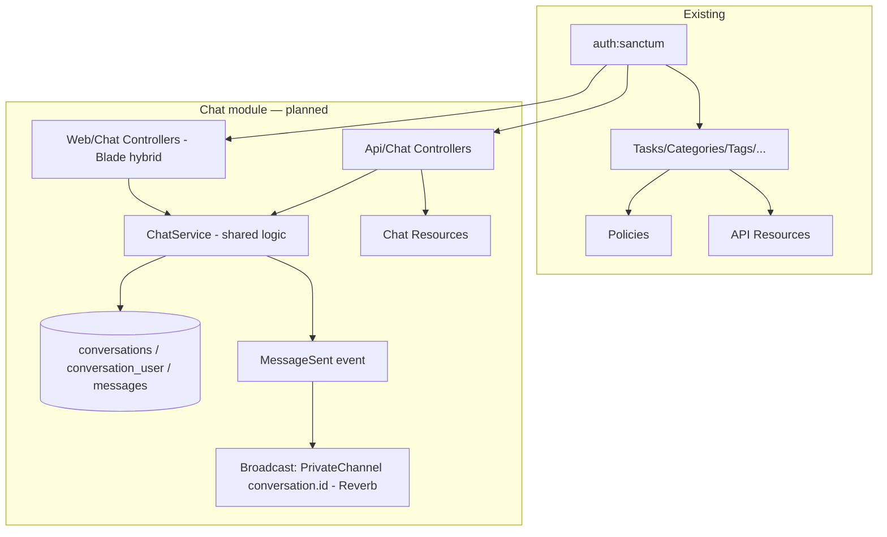

# Architecture Overview

High-level architecture of the Laravel 13 Task Manager API and the **planned** Chat module. Full built-system detail lives in [features/PROJECT_BRAIN.md](features/PROJECT_BRAIN.md); per-feature docs are in [features/task-manager.md](features/task-manager.md) and [features/chat.md](features/chat.md).

---

## 1. Stack
Laravel 13.8 · PHP 8.3/8.4 · MySQL · Sanctum token auth · slim application structure (no Kernel/Handler files; `Gate::policy` / `Event::listen` in `AppServiceProvider`; scheduler in `routes/console.php`). JSON API, no Blade UI today (except welcome/email).

## 2. Existing modules (built)
Auth · Tasks (CRUD, filter, pin, bulk, soft-delete/restore, recurrence) · Categories · Tags · Comments · Attachments · Subtasks · Time tracking. All follow: Route → Form Request → Controller → Policy → `DB::transaction` → Observer/Event → API Resource → JSON.

Cross-cutting conventions: Policy-based ownership, API Resources (`withoutWrapping`), transactional writes, uniform try/catch + `Log::error`, rate limiters (`api` 60/min, `auth` 10/min), Observer (`TaskObserver`), queued Job (`SendWelcomeMail`).

## 3. Planned module — Chat (PLAN ONLY)

> Not yet implemented. See [features/chat.md](features/chat.md) and [features/chat-database-design.md](features/chat-database-design.md). Do not assume this code exists.

One-to-one messaging, API-first, with a Blade **server-render + API hybrid** frontend consuming a shared **ChatService** (the one new structural layer — justified by the hybrid needing identical logic in web and API controllers). Future-proofed for group chat via a participants pivot + `type` enum.

### Integration points
- Reuses `auth:sanctum`, Policy/Resource/Request conventions, queue, event registration style.
- Adds `ConversationPolicy` / `MessagePolicy` via `Gate::policy`.
- Adds `MessageSent` (`ShouldBroadcast`) via `Event::listen` style.
- **Requires** wiring `routes/web.php` + `routes/channels.php` into `bootstrap/app.php` (currently only `api` + `commands` are registered) — roadmap Phase 0.
- Adds a `chat-send` rate limiter beside `api` / `auth`.

### Real-time
Reverb (primary, first-party, free, self-hosted) with polling as MVP fallback. Broadcast scoped to the 2-participant private channel, dispatched post-commit.

## 4. What stays untouched
No existing controller, model, or table is modified for Chat except: `User` gains chat relationships, `AppServiceProvider` gains 2 policy registrations + 1 limiter, `bootstrap/app.php` gains web/channel routing. Everything else is additive — Chat can be removed by deleting its files, routes, and tables.
