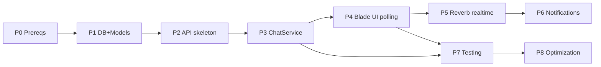

# Chat — Development Roadmap (Phase 10)

> PLAN ONLY. Each milestone is independently testable and shippable. No code until approved.

---

## Phase 0 — Prerequisites (blocking)
- Register `routes/web.php` **and** `routes/channels.php` in `bootstrap/app.php` (`->withRouting(web: ..., channels: ...)`). **Web routes are currently not wired** — Blade UI cannot work without this.
- Add `chat-send` rate limiter in `AppServiceProvider`.
- Introduce base Blade layout `layouts/app.blade.php`.
- **Testable:** a trivial `/chat` route returns a view; `web` middleware active.

## Phase 1 — Database & Models
- Migrations: `conversations`, `conversation_user`, `messages` (per [chat-database-design.md](chat-database-design.md)).
- Models: `Conversation`, `Message` + `User` relationships. Casts, `$fillable`, `direct_hash` helper.
- Factories for all three.
- **Testable:** factory + relationship unit tests (create conversation, attach participants, add messages, unread anchor).

## Phase 2 — API endpoints (skeleton)
- Routes in `routes/api.php` (auth:sanctum group).
- Controllers `Api/Chat/*`, Form Requests, Resources.
- Policies `ConversationPolicy`, `MessagePolicy` + `Gate::policy` registration.
- **Testable:** feature tests for auth, participant authorization (403/404), validation (422) — before business logic is complete.

## Phase 3 — Business logic (ChatService)
- `ChatService`: find-or-create direct conversation (race-safe), send message (idempotent, transactional, updates denormalized fields), list conversations (unread count), mark read, search users.
- **Testable:** feature tests for create/find idempotency, send + dedup via `client_message_id`, unread counts, mark-read monotonicity, cursor message pagination, edge cases from [chat-edge-cases.md](chat-edge-cases.md).

## Phase 4 — Blade UI (hybrid, polling)
- Web controllers `Web/Chat/*` calling `ChatService`.
- Views: `chat/index`, partials (list, thread, composer); empty/loading/error states; responsive.
- `chat.js` (axios) for send / fetch older / mark read. Real-time via **polling** first.
- **Testable:** web routes render; manual UI walkthrough; JS calls hit the API and update the DOM.

## Phase 5 — Real-time (Reverb)
- Install Reverb + Echo. `MessageSent implements ShouldBroadcast` on `PrivateChannel("conversation.{id}")`; channel auth in `channels.php`.
- Client subscribes via Echo; polling becomes fallback.
- **Testable:** two sessions, message from A appears live for B; channel auth denies non-participants.

## Phase 6 — Notifications (optional)
- Listener on `MessageSent` to notify offline recipients (database/mail notification). Reuses queue.
- **Testable:** notification dispatched when recipient not present; suppressed when active.

## Phase 7 — Testing & hardening
- Full feature + unit coverage (mirror the existing test suite style, `RefreshDatabase`, factories, `actingAs`).
- Security checklist ([chat-security.md](chat-security.md)) verified.
- **Testable:** green suite; coverage of every endpoint + edge case.

## Phase 8 — Optimization
- Verify indexes/query plans; add caching (user search, participant set); bound DOM window on scroll; confirm broadcast fan-out is channel-scoped.
- **Testable:** query counts asserted; large-thread scroll profiled.

---

## Dependency order

## Assumptions & risks
- **Assumption:** MySQL, moderate volume, Sanctum auth stay as-is.
- **Risk:** Phase 0 web-route wiring touches `bootstrap/app.php` (shared file) — small, reversible.
- **Risk:** Reverb adds a long-running process + worker to deploy; MVP is usable on polling without it.
- **Assumption:** No existing notification/presence system to reuse — kept minimal, deferred to Phase 6+.
