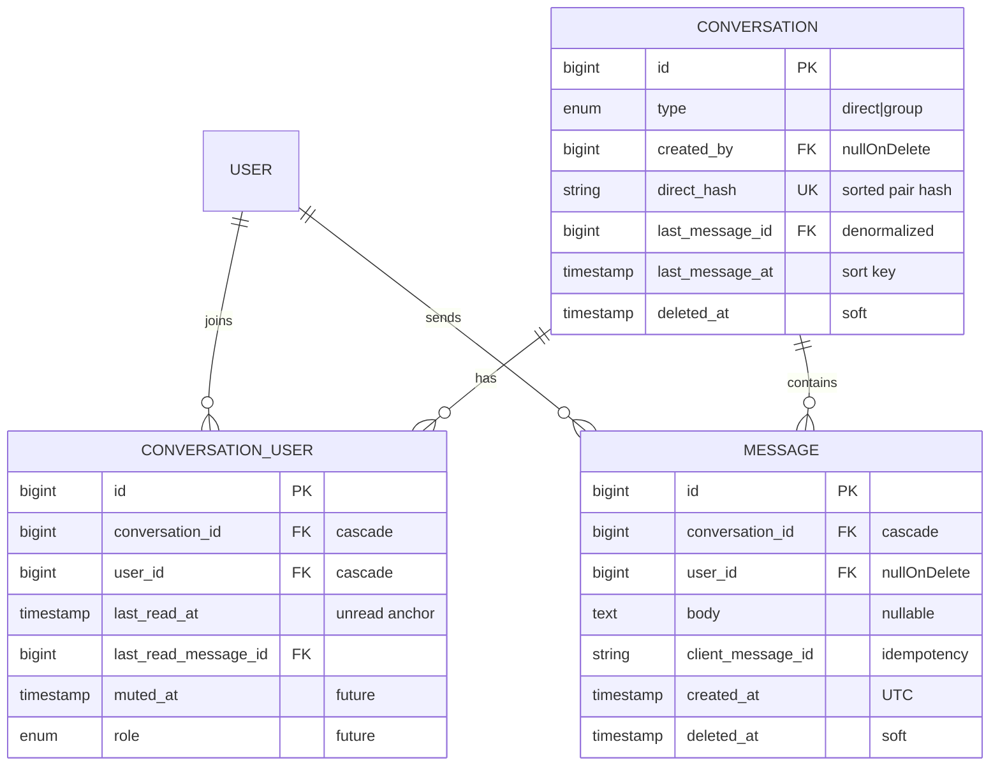

# Chat — Database Design (Phase 3)

> PLAN ONLY. No migrations generated. MySQL, InnoDB, utf8mb4. Follows existing conventions (see [PROJECT_BRAIN.md](PROJECT_BRAIN.md) §5): `bigint` PKs, `foreignId()->constrained()`, cascade rules, `timestamps`, soft deletes where recovery matters.
>
> This is the standalone DB-schema doc for the Chat module. Everything else (overview, architecture, API, security, performance, edge cases, roadmap) lives in [chat.md](chat.md).

---

## 1. Tables overview

| Table | Purpose |
|-------|---------|
| `conversations` | A chat thread (direct now, group later) |
| `conversation_user` | Participants pivot + per-user read state |
| `messages` | Individual messages |
| `message_attachments` | **FUTURE** — files on a message (reserved, not built) |
| `message_user` | **FUTURE** — per-message read receipts (reserved) |

---

## 2. `conversations`

| Column | Type | Notes |
|--------|------|-------|
| `id` | bigint PK | |
| `type` | enum(`direct`,`group`) default `direct` | Future-proofs group chat without schema change |
| `created_by` | FK→users, `nullOnDelete` | Who initiated; nullable so a deleted user doesn't erase the thread |
| `direct_hash` | string(64) nullable, **unique** | For `direct` type: deterministic hash of the sorted participant id pair (e.g. `sha1("{min}-{max}")`). Guarantees exactly one direct conversation per pair; `null` for group |
| `last_message_id` | FK→messages nullable, `nullOnDelete` | Denormalized pointer to newest message (list preview without a join) |
| `last_message_at` | timestamp nullable | Denormalized sort key for the conversation list (indexed) |
| `created_at` / `updated_at` | timestamps | |
| `deleted_at` | soft delete | Allow hiding/restoring a thread |

**Indexes:** unique(`direct_hash`); index(`type`); index(`last_message_at`).
**FK note:** `last_message_id` is a nullable back-reference; set/updated when a message is inserted.

## 3. `conversation_user` (participants)

| Column | Type | Notes |
|--------|------|-------|
| `id` | bigint PK | |
| `conversation_id` | FK→conversations, `cascadeOnDelete` | |
| `user_id` | FK→users, `cascadeOnDelete` | |
| `joined_at` | timestamp nullable | When added (group-relevant) |
| `last_read_at` | timestamp nullable | Read-receipt anchor → unread count = messages after this |
| `last_read_message_id` | FK→messages nullable, `nullOnDelete` | Precise read marker (alternative/complement to timestamp) |
| `muted_at` | timestamp nullable | **FUTURE** notifications mute |
| `role` | enum(`member`,`admin`) default `member` | **FUTURE** group roles; harmless for direct |
| `created_at` / `updated_at` | timestamps | |

**Indexes:** **unique(`conversation_id`,`user_id`)** (a user joins a thread once); index(`user_id`) (list a user's conversations); composite index(`user_id`,`conversation_id`).

## 4. `messages`

| Column | Type | Notes |
|--------|------|-------|
| `id` | bigint PK | Monotonic → authoritative ordering key |
| `conversation_id` | FK→conversations, `cascadeOnDelete` | |
| `user_id` | FK→users, `nullOnDelete` | Sender; nullable so a deleted user's messages survive as "Deleted user" |
| `body` | text nullable | Message text; nullable to allow future attachment-only messages |
| `client_message_id` | uuid/string(64) | Client-generated idempotency key → dedup double-sends |
| `created_at` / `updated_at` | timestamps | `created_at` = sent time (store UTC) |
| `deleted_at` | soft delete | **FUTURE** message deletion; present now for consistency |

**Indexes:**
- **composite index(`conversation_id`,`id`)** — the hot path: fetch a thread's messages in order, cursor-paginate.
- **unique(`conversation_id`,`client_message_id`)** — enforces idempotency per thread.
- index(`user_id`).

## 5. `message_attachments` — FUTURE (reserved, not built)

`id`, `message_id` FK cascade, `original_name`, `path`, `size` (bytes), `mime_type`, timestamps. Mirrors the existing `attachments` table so file handling reuses known patterns.

## 6. `message_user` — FUTURE (reserved)

Per-message read receipts for group chat: `message_id` FK, `user_id` FK, `read_at`, unique(`message_id`,`user_id`). MVP uses `conversation_user.last_read_at` instead — cheaper.

---

## 7. Field-level rationale highlights

- **`direct_hash`** solves the "one conversation per pair" problem deterministically and race-safely (unique constraint catches concurrent creates — see [chat.md §12 Edge Cases](chat.md#12-edge-cases)).
- **Denormalized `last_message_id` / `last_message_at`** make the conversation-list query index-only sortable, avoiding a correlated subquery or join per row (see [chat.md §11 Performance](chat.md#11-performance)).
- **`client_message_id` + unique** is the backbone of idempotent sends across retries, refreshes, and simultaneous submits.
- **Server `id` for ordering** (not `created_at`) sidesteps clock-drift/timezone ordering bugs.
- **Nullable `user_id` (`nullOnDelete`)** keeps history intact when an account is deleted.
- **`type` + `role` + pivot** mean group chat is additive: create a `group` conversation, add >2 participants. Zero changes to `messages`.

## 8. Cascade summary

- Delete conversation → participants + messages cascade (hard). Soft delete hides without cascade.
- Delete user → their messages' `user_id` → null (history kept); their participant rows cascade out.
- Delete message → attachments cascade (future).

## 9. Entity diagram

