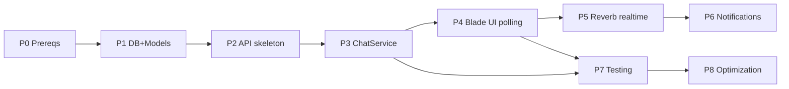

# Feature — One-to-One Chat Module

> **Status:** PLAN ONLY — no code written yet. Awaiting approval before implementation.
> Part of the Laravel 13 Task Manager API. The database schema lives in its own doc: [chat-database-design.md](chat-database-design.md). Built-system reference: [PROJECT_BRAIN.md](PROJECT_BRAIN.md).
>
> This document consolidates what were previously seven separate planning files (overview, architecture, API design, security, performance, edge cases, roadmap) into one. Only the DB schema is kept as a sibling file.

---

## Table of Contents

1. [Summary](#1-summary)
2. [Goals](#2-goals)
3. [Non-Goals (this phase)](#3-non-goals-this-phase)
4. [Why this design fits the existing project](#4-why-this-design-fits-the-existing-project)
5. [Key design decisions](#5-key-design-decisions)
6. [Integration points with the existing system](#6-integration-points-with-the-existing-system)
7. [Risks & assumptions](#7-risks--assumptions)
8. [Architecture](#8-architecture)
9. [API Design](#9-api-design)
10. [Security](#10-security)
11. [Performance](#11-performance)
12. [Edge Cases](#12-edge-cases)
13. [Development Roadmap](#13-development-roadmap)
14. [Future enhancements](#14-future-enhancements)

---

## 1. Summary

A self-contained Chat module providing **one-to-one (direct) messaging** between authenticated users. Built API-first on the existing architecture; the web UI (Blade) consumes the same backend logic. Designed so **group chat** can be added later without a schema rewrite.

## 2. Goals

- Direct 1:1 conversations between two users.
- Send / receive text messages.
- Conversation list with last message + unread count.
- Mark conversation as read.
- Search users (to start a chat) and search conversations.
- Real-time delivery (recommended: Laravel Reverb) with a polling fallback for MVP.
- Blade web frontend that reuses the same business logic as the API — no duplication.

## 3. Non-Goals (this phase)

- Group chat (schema is future-proofed for it, but not built).
- Attachments/file messages (schema reserves space; not built).
- Message editing/deletion (API reserved; not built in MVP).
- Blocking, typing indicators, presence/online status (reserved as future events).

## 4. Why this design fits the existing project

The current app is a **slim Laravel 13 JSON API** with: Sanctum token auth, Policy-based authorization, API Resources, Form Requests, `DB::transaction` writes, an Observer + Event/Listener example, a queued Job, and rate limiters. See [PROJECT_BRAIN.md](PROJECT_BRAIN.md).

The Chat module mirrors every one of those conventions (detailed in [§8 Architecture](#8-architecture)). The single **new** structural element is a thin **ChatService** — justified because the chosen web strategy (Blade server-render + API hybrid) means both the API controllers and the web controllers must run the same logic. A shared service is the only clean way to satisfy the "no duplicate business logic" requirement.

## 5. Key design decisions

| Decision | Choice | Why |
|----------|--------|-----|
| Conversation model | `conversations` + `conversation_user` pivot (participants) | Many-to-many from day one → group chat = just add participants |
| Direct-chat uniqueness | `direct_hash` column (sorted user-id pair) unique | Guarantees one direct conversation per pair; avoids race duplicates |
| Message ordering | Server `id` (bigint, monotonic) + `client_message_id` for dedup | Robust under clock drift and double-send |
| Message pagination | Cursor-based (not offset) | Stable under concurrent inserts; performant on large threads |
| Unread tracking | `last_read_at` on participant pivot | Cheap unread count; no per-message read table needed for MVP |
| Web frontend | Blade server-render + API hybrid over a shared ChatService | Reuses logic; no Vue; progressive enhancement |
| Real-time | Laravel Reverb (primary) + polling fallback | First-party, free, self-hosted; polling keeps MVP shippable |

## 6. Integration points with the existing system

- **Auth:** reuses `auth:sanctum`. No new auth.
- **User model:** adds `conversations()` / `messages()` relationships. No column changes required for MVP.
- **Authorization:** new `ConversationPolicy`, `MessagePolicy`, registered via `Gate::policy()` in `AppServiceProvider` (same as existing policies).
- **Events/Queue:** new `MessageSent` event (implements `ShouldBroadcast`), reusing the existing `Event::listen` registration style and queue infrastructure.
- **Routing:** new chat routes appended to `routes/api.php`; **web routes require `routes/web.php` to be registered in `bootstrap/app.php` first** (currently it is not — see [roadmap Phase 0](#phase-0--prerequisites-blocking)).
- **Rate limiting:** a new `chat-send` limiter added alongside `api` / `auth`.

## 7. Risks & assumptions

- **Assumption:** MySQL remains the datastore; messages volume is moderate (thousands, not billions) for MVP. High scale would later warrant partitioning/archival (out of scope).
- **Risk:** `routes/web.php` is not wired into the slim bootstrap. Blade UI cannot work until that is fixed (small, contained change; Phase 0).
- **Risk:** Real-time adds infra (Reverb server / queue worker). Mitigated by shipping MVP on polling first, layering Reverb in Phase 5.
- **Assumption:** No existing presence/notification system to reuse — Chat introduces its own event, kept minimal.

---

## 8. Architecture

> Covers module boundaries, responsibilities, request lifecycle, the frontend plan (Blade hybrid), and the real-time strategy.

### 8.1 Module boundaries

The Chat module is a vertical slice inside the existing app namespace (the project is small; a separate package is unnecessary). All chat classes are grouped under `Chat` sub-namespaces so the boundary is obvious and could later be extracted.

```
app/
  Http/
    Controllers/
      Api/Chat/
        ConversationController.php     # JSON API
        MessageController.php
        ChatUserController.php         # user search
      Web/Chat/
        ChatPageController.php         # Blade server-render (hybrid)
    Requests/Chat/
      StoreConversationRequest.php
      StoreMessageRequest.php
      MarkReadRequest.php
    Resources/Chat/
      ConversationResource.php
      MessageResource.php
      ChatUserResource.php
  Models/
    Conversation.php
    Message.php
    (participants via conversation_user pivot — no model needed for MVP)
  Policies/
    ConversationPolicy.php
    MessagePolicy.php
  Services/Chat/
    ChatService.php                    # SHARED business logic (new layer)
  Events/
    MessageSent.php                    # implements ShouldBroadcast
  Listeners/
    (optional) Broadcastable handled by event; notification listener = future
resources/
  views/chat/
    index.blade.php                    # chat shell (list + window)
    partials/conversation-list.blade.php
    partials/message-thread.blade.php
    partials/composer.blade.php
  js/chat/
    chat.js                            # axios calls + Echo subscription
routes/
  api.php                              # + chat API routes
  web.php                              # + chat page routes (MUST be registered first)
  channels.php                         # broadcast channel authorization (new)
```

**Why a `Services/Chat/` layer** (the project has none today): the chosen web strategy renders initial state server-side **and** exposes the same operations over the API. Both entry points must execute identical logic (create-or-find conversation, send message, compute unread). Putting that logic in a `ChatService` means controllers stay thin and there is exactly one implementation — satisfying "no duplicate business logic." Existing non-chat controllers are left untouched; this layer is scoped to Chat.

### 8.2 Responsibilities

| Layer | Responsibility | Must NOT do |
|-------|----------------|-------------|
| Route | Map URL → controller, attach middleware | Business logic |
| Form Request | Validate shape of input; `authorize()` returns `true` | Ownership checks |
| Policy | Authorize action on a record (participant/sender) | Validation |
| Controller (API) | Call service, return Resource as JSON | Business logic, direct queries |
| Controller (Web) | Call service, return Blade view with data | Duplicate logic (delegates to service) |
| **ChatService** | All business logic: find-or-create conversation, send, mark-read, list, search | HTTP concerns, response formatting |
| Resource | Shape JSON output | Queries |
| Event | `MessageSent` broadcast payload | Persistence |
| Model | Relationships, scopes, casts | Controller logic |

### 8.3 Request lifecycle (mirrors existing app)

**API send message:**
```
POST /api/conversations/{id}/messages
  → auth:sanctum
  → throttle:chat-send
  → StoreMessageRequest (validate body, client_message_id)
  → ConversationController@... calls $this->authorize('sendMessage', $conversation)  [ConversationPolicy]
  → ChatService::sendMessage() inside DB::transaction
      → persist message, bump conversation.last_message_at, dispatch MessageSent
  → MessageResource → JSON (201)
  (try/catch + Log::error fallback → 500, exactly like existing controllers)
```

**Web (hybrid):**
```
GET /chat  (web middleware, auth)
  → ChatPageController@index
  → ChatService::listConversations($user)   [SAME service the API uses]
  → return view('chat.index', [...])         server-rendered initial list + empty window
Then in the browser:
  → chat.js loads messages + sends via the JSON API (axios)
  → Echo subscribes to private-conversation.{id} for live inbound messages
```

This is the **hybrid**: first paint is server-rendered (fast, SEO-neutral, works without JS for the list), live interaction is API + WebSocket. Both paths funnel through `ChatService`.

### 8.4 Dependencies

- **Inward:** Chat depends on `User` (existing), Sanctum, the Policy/Resource/Request conventions, the queue, and (for real-time) broadcasting.
- **Outward:** nothing in the existing app depends on Chat. Removing Chat = drop its files + routes + tables. Clean seam.

### 8.5 Integration points

1. `User` model gains `conversations()` (belongsToMany through pivot) and `messages()` (hasMany).
2. `AppServiceProvider::boot()` registers `Gate::policy(Conversation::class, ConversationPolicy::class)` and `Gate::policy(Message::class, MessagePolicy::class)` — same pattern as the 7 existing policies.
3. `bootstrap/app.php` — **register `routes/web.php` and `routes/channels.php`** (web is currently unregistered). Add the `chat-send` rate limiter in `AppServiceProvider`.
4. `routes/api.php` — append chat endpoints inside the existing `auth:sanctum` group.

### 8.6 Frontend plan (Phase 5) — Blade server-render + API hybrid, no Vue

**Layout**
- Reuse/introduce a base layout `resources/views/layouts/app.blade.php` (none exists yet beyond `welcome`). Chat page extends it.
- Two-pane responsive layout: left = conversation list, right = active conversation.

**Screens / partials**
- **`chat/index.blade.php`** — shell; server-renders the conversation list (from `ChatService::listConversations`) and an empty/selected conversation window.
- **`partials/conversation-list.blade.php`** — each row: other user's name, last message snippet, time, unread badge. Server-rendered initially; updated live via JS.
- **`partials/message-thread.blade.php`** — message bubbles; sender vs receiver alignment. Blade `{{ }}` auto-escapes body (XSS defense).
- **`partials/composer.blade.php`** — textarea + send button; disabled when empty.

**States**
- **Empty state:** no conversations → prompt "Search a user to start chatting."
- **Loading state:** skeleton rows / spinner while axios fetches older messages.
- **Error state:** inline banner on failed send with a retry button (message stays in composer / marked "failed").
- **Responsive:** desktop = two panes side by side; mobile = list first, tap opens thread full-screen with back button.

**UI flow**
1. User opens `/chat` → server-rendered list appears instantly.
2. Click a conversation → `chat.js` fetches messages via `GET /api/conversations/{id}/messages` (cursor), renders thread, calls `POST .../read`.
3. Type + send → optimistic bubble appended with a temp state → `POST .../messages` with a `client_message_id` → on success replace temp with server message; on failure mark "failed" + retry.
4. Inbound message via Echo (`MessageSent`) → append to thread if open, else bump list + unread badge.
5. Infinite scroll up → fetch older page via cursor.

**JS assets**
- Existing stack is Vite + axios. Add **Alpine.js** optional for small reactive bits, or plain JS modules in `resources/js/chat/`. Add **Laravel Echo** + a WebSocket client (Reverb/Pusher JS) for real-time. No SPA framework, no Vue.

### 8.7 Real-time strategy (Phase 6)

**Options evaluated**

| Approach | Pros | Cons | Cost | Scale | Deploy |
|----------|------|------|------|-------|--------|
| **Laravel Reverb** | First-party (L11+), WebSocket, free, self-host, integrates with Echo/broadcasting | Runs a separate process; you manage scaling | Free (infra only) | Good (horizontal w/ Redis) | `php artisan reverb:start` + supervisor |
| **Pusher (SaaS)** | Zero infra, easy, reliable | Paid beyond free tier; third-party data egress | $$ per messages/connections | Managed | Config only |
| **Ably** | Like Pusher, generous free tier | Third-party dependency | $ | Managed | Config only |
| **Raw WebSockets** | Full control | Reinvents auth/scaling/reconnect | Free | DIY | Heavy |
| **Polling** | Trivial, no infra, works everywhere | Latency + wasted requests | Free | Poor at scale | None |
| **SSE** | Simple server→client stream | One-way; awkward with PHP-FPM workers | Free | Medium | Medium |

**Recommendation: Reverb as the primary target, polling as the MVP fallback.**

- Ship MVP on **short-interval polling** (`GET /api/conversations` + messages since cursor every N seconds) so the feature works with zero new infra.
- Layer **Reverb** in Phase 5 of the roadmap: `MessageSent implements ShouldBroadcast` on `PrivateChannel("conversation.{id}")`, authorized in `routes/channels.php` via participant check, client subscribes with Echo. Polling stays as automatic fallback if the socket drops.

Rationale: Reverb is the idiomatic Laravel 13 choice, free, and self-hosted (no per-message billing like Pusher). Polling-first keeps the module shippable and testable before committing to the WebSocket process.

**Broadcast optimization**
- Broadcast only to the private conversation channel (2 participants), never a global channel.
- Payload = the `MessageResource` shape, so the client needs no extra fetch.
- Dispatch broadcast **after commit** (queue the event) so a rolled-back transaction never emits a phantom message.

---

## 9. API Design

> All endpoints under `/api`, inside the existing `auth:sanctum` group. Responses follow existing conventions: single resource = bare (no `data` wrapper, via `JsonResource::withoutWrapping()`); collections wrapped under a named key or `data` + `meta` for paginated lists. Errors mirror the global handlers in `bootstrap/app.php` (401/403/404/422/500).

### 9.1 Conventions

- **Auth:** every endpoint requires `auth:sanctum`. Missing/invalid token → `401 {"message":"Unauthenticated."}`.
- **Authorization:** participant/sender checks via `ConversationPolicy` / `MessagePolicy`. Denied → `403 {"message":"Forbidden."}` (friendly per-action message in controller).
- **Validation:** Form Requests; failure → `422 {"message":"Validation failed.","errors":{...}}`.
- **Not found / not a participant:** `404 {"message":"Conversation not found."}` (return 404 rather than 403 for non-participants to avoid leaking existence — see [§10 Security](#10-security)).
- **Message pagination:** **cursor-based** (`?cursor=&limit=`). Conversation list: page-based (matches existing `meta` shape).
- **Rate limiting:** send endpoint uses `throttle:chat-send`.

### 9.2 List conversations

```
GET /api/conversations
```
- **Auth/Authz:** authenticated user; returns only conversations they participate in.
- **Query:** `?search=` (filter by other participant name), `?page=` (paginate, 15/page).
- **Sort:** `last_message_at DESC` (denormalized).
- **Response 200:**
```json
{
  "message": "Conversations fetched successfully",
  "data": [
    {
      "id": 12,
      "type": "direct",
      "other_participant": { "id": 5, "name": "Alice" },
      "last_message": { "id": 900, "body": "see you", "user_id": 5, "created_at": "..." },
      "unread_count": 3,
      "last_message_at": "..."
    }
  ],
  "meta": { "current_page": 1, "last_page": 4, "total": 37 }
}
```
- **Errors:** 401.

### 9.3 Create (or find) conversation

```
POST /api/conversations
```
- **Body:** `{ "user_id": 5 }` (the other participant).
- **Validation:** `user_id` required, exists in users, not equal to auth user.
- **Behavior:** find-or-create the direct conversation via `direct_hash`. Idempotent — returns existing if present (200) or new (201).
- **Authz:** any authenticated user may start a direct chat (future: respect blocking).
- **Response 201/200:** the `ConversationResource`.
- **Errors:** 422 (missing/invalid/self user_id), 401.

### 9.4 Open / show conversation

```
GET /api/conversations/{conversation}
```
- **Authz:** `view` policy — must be a participant.
- **Response 200:** conversation meta + participants (not messages — those are paginated separately).
- **Errors:** 404 (missing or not a participant), 401.

### 9.5 Fetch messages

```
GET /api/conversations/{conversation}/messages
```
- **Authz:** `view` policy (participant).
- **Query:** `?cursor=<opaque>&limit=30` (default 30, max 100). Cursor pagination on `id`.
- **Sort:** returns a page of messages ordered `id ASC` within the page; client requests older pages by passing the earliest cursor (infinite scroll upward).
- **Response 200:**
```json
{
  "message": "Messages fetched successfully",
  "data": [ { "id": 899, "body": "hi", "user_id": 5, "client_message_id": "uuid", "created_at": "..." } ],
  "meta": { "next_cursor": "eyJpZCI6ODcwfQ", "has_more": true }
}
```
- **Errors:** 404, 401.

### 9.6 Send message

```
POST /api/conversations/{conversation}/messages
```
- **Middleware:** `throttle:chat-send`.
- **Authz:** `sendMessage` policy (participant).
- **Body:** `{ "body": "hello", "client_message_id": "uuid-v4" }`.
- **Validation:** `body` required unless (future) attachment, string, max 5000, not blank after trim; `client_message_id` required, uuid, unique per conversation.
- **Behavior (in `DB::transaction`):** insert message → update `conversations.last_message_id` + `last_message_at` → dispatch `MessageSent` (broadcast after commit). Duplicate `client_message_id` returns the existing message (200, idempotent) instead of erroring.
- **Response 201:** the `MessageResource`. Duplicate → 200 same resource.
- **Errors:** 422 (empty/too long/missing key), 403→404 (not participant), 429 (rate limit), 401, 500.

### 9.7 Mark conversation as read

```
POST /api/conversations/{conversation}/read
```
- **Authz:** participant.
- **Body:** `{ "last_read_message_id": 900 }` (optional; defaults to newest).
- **Behavior:** set participant `last_read_at` / `last_read_message_id`. Idempotent.
- **Response 200:** `{ "message": "Marked as read", "unread_count": 0 }`.
- **Errors:** 404, 401.

### 9.8 Delete conversation

```
DELETE /api/conversations/{conversation}
```
- **Authz:** `delete` policy (participant).
- **Behavior (MVP):** soft-delete the thread for record-keeping (or "leave" semantics — decided at build; MVP = soft delete thread).
- **Response 200:** `{ "message": "Conversation deleted successfully" }`.
- **Errors:** 404, 401.

### 9.9 Search users (to start a chat)

```
GET /api/users?search=ali
```
- **Authz:** authenticated.
- **Query:** `search` required (min 2 chars); paginate 10.
- **Response 200:** `{ "message": "...", "data": [ {"id":5,"name":"Alice"} ], "meta": {...} }` — minimal `ChatUserResource` (never expose email/password).
- **Errors:** 422 (search too short), 401.

### 9.10 Search conversations

Covered by [§9.2 List conversations](#92-list-conversations) with `?search=`.

### 9.11 FUTURE endpoints (reserved, not built in MVP)

| Endpoint | Purpose |
|----------|---------|
| `DELETE /api/messages/{message}` | Delete own message (`MessagePolicy@delete`, sender only) |
| `POST /api/conversations/{id}/typing` | Typing status → broadcast only, no persistence |
| `GET /api/users/{id}/presence` | Online status (presence channel) |
| `POST /api/conversations/{id}/participants` | Add participant (group chat) |
| `POST /api/messages/{id}/attachments` | File messages (mirrors existing attachments API) |

### 9.12 Web (hybrid) routes — consume the same service, not duplicate logic

```
GET /chat                       → ChatPageController@index   (server-render list shell)
GET /chat/{conversation}        → ChatPageController@show    (server-render with thread preloaded)
```
These Blade routes call `ChatService` (the same one the API controllers use). Live actions (send, fetch older, mark read) happen through the JSON API above via axios. **Requires `routes/web.php` registration in `bootstrap/app.php` (Phase 0).**

**Route ordering note:** Static/shallow routes (`/messages/{message}`, `/users`) and literal segments must be declared to avoid clashing with `{conversation}` wildcards — same discipline the existing `tasks/bulk` vs `tasks/{task}` ordering uses.

---

## 10. Security

### 10.1 Authentication
Reuses `auth:sanctum`. Every API and web chat route sits behind it. Broadcast channels authenticated via Sanctum in `routes/channels.php`. No new auth surface.

### 10.2 Authorization & conversation ownership
- `ConversationPolicy`: `view`, `sendMessage`, `delete` all require the user to be a **participant** (`conversation.users` contains `user->id`). Mirrors the existing ownership pattern (`$user->id === $model->user_id`), extended to a membership check.
- `MessagePolicy@delete` (future): sender only.
- Controllers call `$this->authorize(...)`; denial → 403 handled globally.
- **Existence hiding:** for non-participants, return **404 not 403** on show/messages so the API doesn't confirm a conversation exists to outsiders.

### 10.3 User validation
- `POST /conversations` validates `user_id` `exists:users,id` and `!= auth id` (no self-chat).
- User search returns a **minimal resource** (`id`, `name` only) — never email, tokens, or internal fields.
- Deleted target user → `exists` rule fails → 422.

### 10.4 Rate limiting & spam protection
- New `chat-send` limiter (e.g. 30/min per user) in `AppServiceProvider`, alongside existing `api`(60) and `auth`(10). Prevents flooding.
- Conversation creation limited by the global `api` limiter.
- `client_message_id` uniqueness prevents accidental duplicate storms.
- Future: content heuristics / block list.

### 10.5 XSS prevention
- **Web render:** Blade `{{ $message->body }}` auto-escapes HTML. Never use `{!! !!}` for user content.
- **API:** returns raw text; the JS client inserts via `textContent` (not `innerHTML`) when rendering live messages.
- Body stored as plain text; no HTML/markdown rendering in MVP.

### 10.6 CSRF
- **API:** stateless token auth (Sanctum bearer) — CSRF not applicable.
- **Web pages:** served under the `web` middleware group → CSRF token required on any state-changing form. Since state changes go through the token-authenticated API (axios with bearer), CSRF is naturally sidestepped; if cookie-based session is used for web, include the `X-CSRF-TOKEN` header.

### 10.7 API security (general)
- HTTPS assumed in production (Sanctum tokens in transit).
- Input validated + length-capped (`body` max 5000) to bound payloads.
- Mass-assignment: models use explicit `$fillable`; sender `user_id` set from `auth()`, never from request body.
- Broadcast payload contains only the `MessageResource` (no sensitive fields).

### 10.8 Broadcast channel security
- `PrivateChannel("conversation.{id}")` authorized in `routes/channels.php`: callback returns `true` only if the authenticated user is a participant. Prevents eavesdropping on others' threads.

### 10.9 File upload security — FUTURE
When attachments land: validate mime + size (reuse existing 10 MB attachment rule), store on non-public disk, stream via authorized route, never trust client filename, consider AV scan. Reserved, not in MVP.

### 10.10 Checklist
- [ ] Participant-only policies on every conversation/message action
- [ ] 404 (not 403) for non-participants to hide existence
- [ ] `chat-send` throttle registered
- [ ] User search resource excludes email/sensitive fields
- [ ] Blade auto-escaping; JS uses `textContent`
- [ ] Channel auth checks participation
- [ ] `user_id` from auth, never request body

---

## 11. Performance

### 11.1 Message pagination — cursor, not offset
Offset pagination (`LIMIT n OFFSET m`) degrades on long threads and skips/repeats rows when new messages arrive mid-scroll. **Cursor pagination on `id`** (`WHERE id < :cursor ORDER BY id DESC LIMIT n`) is O(index-seek), stable under concurrent inserts, and ideal for infinite scroll. Backed by composite index (`conversation_id`, `id`).

### 11.2 Conversation list — denormalized sort
List query orders by `conversations.last_message_at DESC` (indexed) and reads `last_message_id` for the preview — **no join or correlated subquery** per row. `last_message_at` is updated in the same transaction as message insert.

### 11.3 Unread count — cheap
Unread = messages in the conversation with `id > participant.last_read_message_id` (or `created_at > last_read_at`). Computed with a single indexed count per conversation, or batched via a subquery when listing. Avoids a per-message read table in MVP.

### 11.4 N+1 avoidance
- List: eager-load the other participant and last message; compute unread in one aggregated query. Never lazy-load inside a loop (same discipline as `TaskResource::whenLoaded`).
- Resources use `whenLoaded` so relations serialize only when explicitly loaded by the controller/service.

### 11.5 Indexes (from [chat-database-design.md](chat-database-design.md))
- `messages` (`conversation_id`, `id`) — thread fetch + cursor.
- `messages` unique(`conversation_id`, `client_message_id`) — idempotency lookup.
- `conversation_user` unique(`conversation_id`, `user_id`) + index(`user_id`) — membership + "my conversations".
- `conversations` unique(`direct_hash`), index(`last_message_at`).

### 11.6 Caching
- **User search:** short-TTL cache keyed by query term (results change rarely).
- **Participant set** per conversation cacheable for channel-auth + authorization hot path; invalidate on membership change (group-future).
- Do **not** cache message lists (freshness matters); rely on indexes.

### 11.7 Infinite scroll / lazy loading (web)
- Initial thread load = newest 30 via API. Scroll-up fetches older pages by cursor. DOM keeps a bounded window (optionally recycle very old nodes) to cap memory on huge threads.
- Server-rendered first paint (hybrid) shows the list immediately without waiting on JS.

### 11.8 Broadcast optimization
- Emit `MessageSent` only on the private conversation channel (2 recipients), never fan-out globally.
- Broadcast **after commit**, queued, so DB work isn't blocked and rolled-back writes never broadcast.
- Payload is the full `MessageResource` → client renders without a follow-up fetch (saves a round-trip).

### 11.9 Write path
- Single `DB::transaction`: insert message + update conversation denormalized fields. Two indexed writes. Event dispatch is queued (non-blocking).

### 11.10 Scale ceiling (honest)
MVP targets moderate volume on MySQL. At very high scale, later options (out of scope): partition `messages` by conversation/date, archive cold threads, move presence/typing to ephemeral store (Redis), read-replicas for list queries.

---

## 12. Edge Cases

Senior-engineer failure-mode analysis with the chosen handling.

| # | Edge case | Handling |
|---|-----------|----------|
| 1 | **Simultaneous messages** (both users send at once) | Independent inserts; ordering by server `id` (monotonic). Both broadcast on the shared channel. No conflict. |
| 2 | **Duplicate send request** (retry, double-click, refresh mid-send) | `client_message_id` unique per conversation. Second insert hits the unique constraint → return the existing message (200), not a duplicate. Idempotent. |
| 3 | **Race creating a direct conversation** (both users tap "chat" together) | `direct_hash` unique. `find-or-create` inside a transaction; on unique-violation, catch and re-fetch the winner. Exactly one conversation results. |
| 4 | **Deleted user** (sender account removed) | `messages.user_id` → `nullOnDelete`. History survives; UI renders "Deleted user". Participant rows cascade out; conversation may become single-participant → shown read-only. |
| 5 | **Blocked users** (FUTURE) | Reserved: block list checked before create/send → 403. Not in MVP. |
| 6 | **Connection loss** (socket drop) | Client falls back to polling; on reconnect, fetch messages since the last known cursor. No gaps. |
| 7 | **Refresh during sending** | Optimistic bubble lost from DOM, but the `client_message_id` was (or will be) persisted; on reload the message appears from the server. If the request never reached the server, the composer retry / resend uses the same id → still safe. |
| 8 | **Invalid conversation id** | Route-model-binding miss → `404 {"message":"Conversation not found."}` (global handler). |
| 9 | **Unauthorized access** (non-participant) | Policy denies. Return **404** on show/messages (hide existence), **403** on explicit actions. |
| 10 | **Empty / whitespace-only message** | Validation: `body` required, trimmed, `min:1` after trim → 422. |
| 11 | **Large payload** | `body` `max:5000`; global request size limits apply. Oversized → 422 / 413. |
| 12 | **Timezone handling** | Store all timestamps in **UTC**; client formats to local. API returns ISO/UTC strings. |
| 13 | **Clock drift** | Ordering uses server `id`, never client time. `client_message_id` is for dedup only, not ordering. |
| 14 | **Database failure mid-send** | Whole send wrapped in `DB::transaction`; failure rolls back (no partial message, no `last_message_at` bump). Broadcast is post-commit so nothing is emitted. Controller `catch` → `Log::error` + 500, matching existing pattern. |
| 15 | **Broadcast after rollback** | Prevented: event dispatched only after commit (queued). |
| 16 | **Marking read out of order** | `last_read_message_id` only moves forward (`max(current, incoming)`); stale/older read calls are no-ops. |
| 17 | **Self-conversation** | `POST /conversations` rejects `user_id == auth id` (422). |
| 18 | **Conversation with no messages** | Allowed; list shows it with null last message / empty preview; sorts by `created_at` fallback. |
| 19 | **Message to a soft-deleted conversation** | `sendMessage` checks the conversation is active; deleted → 404. |
| 20 | **Very long thread scroll** | Cursor pagination + bounded DOM window ([§11 Performance](#11-performance)). |

**Concurrency invariants**
- One direct conversation per user-pair (`direct_hash` unique).
- One message per (`conversation_id`, `client_message_id`) (unique).
- `last_read_*` monotonic non-decreasing.
- `last_message_at` reflects the newest committed message.

---

## 13. Development Roadmap

> Each milestone is independently testable and shippable. No code until approved.

### Phase 0 — Prerequisites (blocking)
- Register `routes/web.php` **and** `routes/channels.php` in `bootstrap/app.php` (`->withRouting(web: ..., channels: ...)`). **Web routes are currently not wired** — Blade UI cannot work without this.
- Add `chat-send` rate limiter in `AppServiceProvider`.
- Introduce base Blade layout `layouts/app.blade.php`.
- **Testable:** a trivial `/chat` route returns a view; `web` middleware active.

### Phase 1 — Database & Models
- Migrations: `conversations`, `conversation_user`, `messages` (per [chat-database-design.md](chat-database-design.md)).
- Models: `Conversation`, `Message` + `User` relationships. Casts, `$fillable`, `direct_hash` helper.
- Factories for all three.
- **Testable:** factory + relationship unit tests (create conversation, attach participants, add messages, unread anchor).

### Phase 2 — API endpoints (skeleton)
- Routes in `routes/api.php` (auth:sanctum group).
- Controllers `Api/Chat/*`, Form Requests, Resources.
- Policies `ConversationPolicy`, `MessagePolicy` + `Gate::policy` registration.
- **Testable:** feature tests for auth, participant authorization (403/404), validation (422) — before business logic is complete.

### Phase 3 — Business logic (ChatService)
- `ChatService`: find-or-create direct conversation (race-safe), send message (idempotent, transactional, updates denormalized fields), list conversations (unread count), mark read, search users.
- **Testable:** feature tests for create/find idempotency, send + dedup via `client_message_id`, unread counts, mark-read monotonicity, cursor message pagination, edge cases from [§12 Edge Cases](#12-edge-cases).

### Phase 4 — Blade UI (hybrid, polling)
- Web controllers `Web/Chat/*` calling `ChatService`.
- Views: `chat/index`, partials (list, thread, composer); empty/loading/error states; responsive.
- `chat.js` (axios) for send / fetch older / mark read. Real-time via **polling** first.
- **Testable:** web routes render; manual UI walkthrough; JS calls hit the API and update the DOM.

### Phase 5 — Real-time (Reverb)
- Install Reverb + Echo. `MessageSent implements ShouldBroadcast` on `PrivateChannel("conversation.{id}")`; channel auth in `channels.php`.
- Client subscribes via Echo; polling becomes fallback.
- **Testable:** two sessions, message from A appears live for B; channel auth denies non-participants.

### Phase 6 — Notifications (optional)
- Listener on `MessageSent` to notify offline recipients (database/mail notification). Reuses queue.
- **Testable:** notification dispatched when recipient not present; suppressed when active.

### Phase 7 — Testing & hardening
- Full feature + unit coverage (mirror the existing test suite style, `RefreshDatabase`, factories, `actingAs`).
- Security checklist ([§10.10](#1010-checklist)) verified.
- **Testable:** green suite; coverage of every endpoint + edge case.

### Phase 8 — Optimization
- Verify indexes/query plans; add caching (user search, participant set); bound DOM window on scroll; confirm broadcast fan-out is channel-scoped.
- **Testable:** query counts asserted; large-thread scroll profiled.

### Dependency order


**Assumptions & risks**
- **Assumption:** MySQL, moderate volume, Sanctum auth stay as-is.
- **Risk:** Phase 0 web-route wiring touches `bootstrap/app.php` (shared file) — small, reversible.
- **Risk:** Reverb adds a long-running process + worker to deploy; MVP is usable on polling without it.
- **Assumption:** No existing notification/presence system to reuse — kept minimal, deferred to Phase 6+.

---

## 14. Future enhancements

Group chat · attachments · message edit/delete · typing indicators · presence/online · read receipts per message · push/email notifications on missed messages · message reactions · blocking. All reserved in schema/API design so they slot in without breaking changes.
