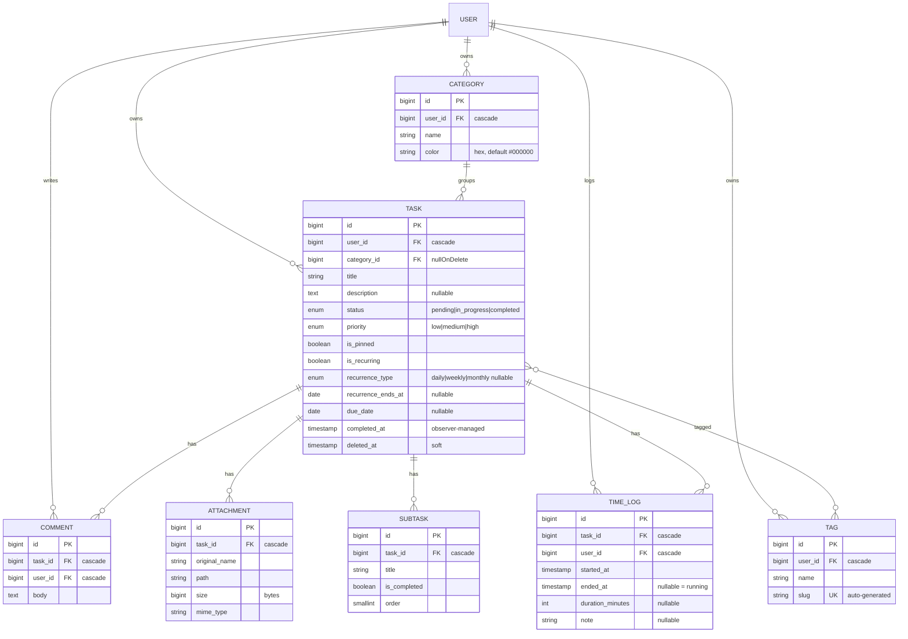

# Task Manager — Database Design

> BUILT / REFERENCE. MySQL (database `task_manager`), InnoDB, utf8mb4. Conventions: `bigint` PKs, `foreignId()->constrained()`, explicit cascade rules, `timestamps`, soft deletes only where recovery matters. Custom migrations are dated `2026_05_*`.
>
> This is the standalone DB-schema doc for the Task Manager core module. Everything else (overview, architecture, API, security, performance, edge cases) lives in [task-manager.md](task-manager.md). Broader system reference: [PROJECT_BRAIN.md](PROJECT_BRAIN.md).

---

## 1. Tables overview

| Table | Purpose |
|-------|---------|
| `users` | Account (Laravel default) — owns everything |
| `categories` | User-defined task grouping with a color |
| `tasks` | Core entity: status, priority, dates, pin, recurrence, soft delete |
| `comments` | Discussion on a task |
| `tags` | User-owned labels (auto-slugged) |
| `tag_task` | Many-to-many pivot: tags ↔ tasks |
| `attachments` | Files uploaded against a task |
| `subtasks` | Ordered checklist items under a task |
| `time_logs` | Time-tracking entries (timers or finished spans) |

Supporting Laravel tables also exist: `password_reset_tokens`, `failed_jobs`, `personal_access_tokens` (Sanctum).

---

## 2. `users` (Laravel default)

`id` (bigint PK), `name`, `email` (unique), `password` (hashed), `email_verified_at` (nullable), `remember_token`, timestamps.

## 3. `categories`

| Column | Type | Notes |
|--------|------|-------|
| `id` | bigint PK | |
| `user_id` | FK→users, **cascadeOnDelete** | user deleted → categories deleted |
| `name` | string | |
| `color` | string | default `#000000` (hex) |
| `created_at` / `updated_at` | timestamps | |

## 4. `tasks`

| Column | Type | Notes |
|--------|------|-------|
| `id` | bigint PK | |
| `user_id` | FK→users, **cascadeOnDelete** | |
| `category_id` | FK→categories nullable, **nullOnDelete** | category deleted → `category_id = null` |
| `title` | string | |
| `description` | text nullable | |
| `status` | enum(`pending`,`in_progress`,`completed`) default `pending` | |
| `priority` | enum(`low`,`medium`,`high`) default `medium` | |
| `is_pinned` | boolean default false | added in a later migration |
| `is_recurring` | boolean default false | |
| `recurrence_type` | enum(`daily`,`weekly`,`monthly`) nullable | drives the observer's next-occurrence math |
| `recurrence_ends_at` | date nullable | recurrence stops once the next date passes this |
| `due_date` | date nullable | must be `after_or_equal:today` on write |
| `completed_at` | timestamp nullable | set/cleared by `TaskObserver`, never by the client |
| `deleted_at` | timestamp | **softDeletes** |
| `created_at` / `updated_at` | timestamps | |

**Only `tasks` uses soft deletes.**

## 5. `comments`

`id`, `task_id` (FK→tasks, **cascadeOnDelete**), `user_id` (FK→users, **cascadeOnDelete**), `body` (text, max 2000 at validation), timestamps.

## 6. `tags`

`id`, `user_id` (FK→users, **cascadeOnDelete**), `name` (string, max 50), `slug` (string, **unique**, auto-generated in `Tag::booted()`), timestamps.

## 7. `tag_task` (pivot)

`tag_id` (FK→tags, **cascadeOnDelete**), `task_id` (FK→tasks, **cascadeOnDelete**), **composite PK** `[tag_id, task_id]`, timestamps (`withTimestamps()`).

## 8. `attachments`

`id`, `task_id` (FK→tasks, **cascadeOnDelete**), `original_name` (string), `path` (string — under `attachments/task-{id}/` on the `local` disk), `size` (unsignedBigInteger, bytes), `mime_type` (string), timestamps.

## 9. `subtasks`

`id`, `task_id` (FK→tasks, **cascadeOnDelete**), `title` (string), `is_completed` (boolean default false), `order` (unsignedSmallInteger default 0 — relationship ordered by this), timestamps.

## 10. `time_logs`

`id`, `task_id` (FK→tasks, **cascadeOnDelete**), `user_id` (FK→users, **cascadeOnDelete**), `started_at` (timestamp), `ended_at` (timestamp nullable — `null` = running timer), `duration_minutes` (unsignedInteger nullable — computed on stop / finished span), `note` (string nullable), timestamps.

---

## 11. Cascade summary

- **User deleted** → tasks, categories, tags cascade-deleted (and their descendants in turn).
- **Category deleted** → tasks' `category_id` set to null (task survives).
- **Task soft-deleted** → comments, attachments, subtasks, time_logs remain in DB but are unreachable through the trashed task; a **hard** delete cascades them.
- **Task restored** → children become reachable again.
- Only **tasks** use soft deletes; every other table is hard-deleted via FK cascade.

## 12. Field-level rationale highlights

- **`completed_at` is observer-managed** — set via `saveQuietly()` when status becomes `completed`, cleared when it moves away. Clients never write it directly.
- **Recurrence trio (`is_recurring`, `recurrence_type`, `recurrence_ends_at`)** lives on `tasks` so each spawned occurrence carries its own schedule forward; the chain is lazy (next task created on completion).
- **`is_pinned`** powers `orderByDesc('is_pinned')` so pinned tasks float to the top of the list without a separate table.
- **`slug` unique on `tags`** guarantees stable, collision-free label identity; generated from `name`.
- **`order` on `subtasks`** makes reordering a cheap integer rewrite; the relationship always reads ordered.
- **`ended_at` nullable on `time_logs`** distinguishes a running timer from a finished span; `duration_minutes` is derived, not trusted from the client on stop.

## 13. Entity diagram

