# Laravel 12 Task Manager API — Technical Documentation

## Table of Contents

1. [Project Overview](#1-project-overview)
2. [Architecture Overview](#2-architecture-overview)
3. [Database Schema](#3-database-schema)
4. [Authentication & Security](#4-authentication--security)
5. [API Endpoints Reference](#5-api-endpoints-reference)
6. [Request Lifecycle & Execution Flow](#6-request-lifecycle--execution-flow)
7. [Models & Relationships](#7-models--relationships)
8. [Business Logic & Observers](#8-business-logic--observers)
9. [Events & Listeners](#9-events--listeners)
10. [Queue & Jobs](#10-queue--jobs)
11. [Policies & Authorization](#11-policies--authorization)
12. [Form Requests & Validation](#12-form-requests--validation)
13. [API Resources](#13-api-resources)
14. [Scheduler & Commands](#14-scheduler--commands)
15. [Diagrams](#15-diagrams)
16. [Feature Flowcharts](#16-feature-flowcharts)
17. [Technical Debt & Concerns](#17-technical-debt--concerns)

---

## 1. Project Overview

A **RESTful JSON API** built with Laravel 12 for managing personal tasks. There are no Blade views — all responses are JSON. The system supports full task lifecycle management including categorization, tagging, commenting, file attachments, subtasks, time tracking, recurring tasks, and bulk operations.

**Stack:** PHP 8.x · Laravel 12 · MySQL · Laravel Sanctum · Laravel Queues · Laravel Scheduler

**Key capabilities:**
- Token-based authentication (Sanctum)
- Resource ownership enforced via Laravel Policies
- Soft deletes with restore support
- Recurring task auto-generation via Observer pattern
- File attachment upload (local disk, max 10MB)
- Time tracking with start/stop timer support
- Ordered subtask checklists

---

## 2. Architecture Overview

```
routes/api.php
    └── Middleware (auth:sanctum, throttle)
        └── Form Request (validation + authorize)
            └── Controller
                ├── Policy (authorization check)
                ├── Eloquent Model (DB operations via DB::transaction)
                │   └── Observer (side-effects: events, recurrence)
                └── API Resource (JSON transformation)
```

**Patterns used:**
- **Repository-less** — Controllers call Eloquent directly
- **Observer pattern** — `TaskObserver` handles `completed_at`, `TaskCompleted` event, and recurring task creation
- **Policy-based authorization** — all ownership checks delegated to `app/Policies/`
- **Form Request validation** — all input validated before hitting the controller
- **API Resources** — all output transformed via `app/Http/Resources/`
- **`JsonResource::withoutWrapping()`** — single resources return flat JSON (no `data` key); collections retain `data`

---

## 3. Database Schema

### Entity Relationship Overview

```
users
 ├── categories (1:N, cascadeOnDelete)
 ├── tasks (1:N, cascadeOnDelete)
 │    ├── comments (1:N, cascadeOnDelete)
 │    ├── attachments (1:N, cascadeOnDelete)
 │    ├── subtasks (1:N, cascadeOnDelete)
 │    ├── time_logs (1:N, cascadeOnDelete)
 │    └── tags (N:M via tag_task, cascadeOnDelete both sides)
 ├── tags (1:N, cascadeOnDelete)
 └── time_logs (1:N, cascadeOnDelete)
```

### Tables

| Table | Purpose | Key Columns |
|---|---|---|
| `users` | Auth & profile | `name`, `email`, `password` |
| `categories` | Task groupings | `user_id`, `name`, `color` (#hex) |
| `tasks` | Core task records | `user_id`, `category_id`, `status`, `priority`, `is_pinned`, `is_recurring`, `recurrence_type`, `due_date`, `completed_at` |
| `comments` | Task comments | `task_id`, `user_id`, `body` (max 2000 chars) |
| `tags` | Reusable labels | `user_id`, `name`, `slug` (auto-generated) |
| `tag_task` | Task↔Tag pivot | `tag_id`, `task_id`, timestamps |
| `attachments` | File metadata | `task_id`, `original_name`, `path`, `size`, `mime_type` |
| `subtasks` | Task checklists | `task_id`, `title`, `is_completed`, `order` |
| `time_logs` | Time tracking | `task_id`, `user_id`, `started_at`, `ended_at`, `duration_minutes`, `note` |
| `personal_access_tokens` | Sanctum tokens | Standard Sanctum schema |
| `failed_jobs` | Queue failures | Standard Laravel schema |

### tasks Table — Full Column List

| Column | Type | Default | Notes |
|---|---|---|---|
| `id` | bigint | — | PK |
| `user_id` | bigint FK | — | cascadeOnDelete |
| `category_id` | bigint FK | null | nullOnDelete |
| `title` | string | — | max 255 |
| `description` | text | null | — |
| `status` | enum | `pending` | pending, in_progress, completed |
| `priority` | enum | `medium` | low, medium, high |
| `is_pinned` | boolean | false | Pinned tasks sort first |
| `is_recurring` | boolean | false | — |
| `recurrence_type` | enum | null | daily, weekly, monthly |
| `recurrence_ends_at` | date | null | Stop recurrence after this date |
| `due_date` | date | null | — |
| `completed_at` | timestamp | null | Set by Observer, not user |
| `deleted_at` | timestamp | null | Soft delete |

---

## 4. Authentication & Security

### Token Authentication (Sanctum)

```
POST /api/auth/register  →  creates token  →  returns plainTextToken
POST /api/auth/login     →  creates token  →  returns plainTextToken
POST /api/auth/logout    →  deletes current token
```

All protected routes use `auth:sanctum` middleware. Tokens never expire (expiration: null in sanctum config). JWT is installed (`tymon/jwt-auth`) but **not wired into routes** — Sanctum is the active auth mechanism.

### Rate Limiting

| Limiter | Route | Limit |
|---|---|---|
| `throttle:auth` | register, login | 10 req/min per IP |
| `throttle:api` | all protected routes | 60 req/min per user/IP |

Custom 429 response: `{"message": "Too many attempts. Please wait X seconds."}` (auth limiter only)

### Authorization Flow

Every controller action calls `$this->authorize('action', $model)`. Laravel resolves the matching Policy method and returns 403 if it returns false. No manual `user_id` comparisons exist in controllers — all ownership logic lives in Policies.

---

## 5. API Endpoints Reference

### Public

| Method | URL | Description |
|---|---|---|
| GET | `/api/health` | Health check |
| POST | `/api/auth/register` | Register user |
| POST | `/api/auth/login` | Login user |

### Protected (Bearer token required)

#### Auth
| Method | URL | Description |
|---|---|---|
| POST | `/api/auth/logout` | Logout |
| GET | `/api/auth/me` | Current user profile |

#### Categories
| Method | URL | Description |
|---|---|---|
| GET | `/api/categories` | List user's categories |
| POST | `/api/categories` | Create category |
| GET | `/api/categories/{id}` | Show category |
| PUT | `/api/categories/{id}` | Update category |
| DELETE | `/api/categories/{id}` | Delete category |

#### Tasks
| Method | URL | Description |
|---|---|---|
| GET | `/api/tasks` | List tasks (paginated, filterable) |
| POST | `/api/tasks` | Create task |
| GET | `/api/tasks/{id}` | Show task (full relationships) |
| PUT | `/api/tasks/{id}` | Update task |
| DELETE | `/api/tasks/{id}` | Soft delete |
| POST | `/api/tasks/bulk` | Bulk action on multiple tasks |
| POST | `/api/tasks/{id}/pin` | Toggle pin |
| POST | `/api/tasks/{id}/restore` | Restore soft-deleted task |

**Task index filters:** `status`, `priority`, `category_id`, `search` (title LIKE). Paginated at 10/page.

#### Comments
| Method | URL | Description |
|---|---|---|
| GET | `/api/tasks/{task}/comments` | List comments |
| POST | `/api/tasks/{task}/comments` | Add comment |
| PUT | `/api/comments/{id}` | Update comment (shallow) |
| DELETE | `/api/comments/{id}` | Delete comment (shallow) |

#### Attachments
| Method | URL | Description |
|---|---|---|
| GET | `/api/tasks/{task}/attachments` | List attachments |
| POST | `/api/tasks/{task}/attachments` | Upload file (multipart, max 10MB) |
| DELETE | `/api/tasks/{task}/attachments/{id}` | Delete attachment |

#### Tags
| Method | URL | Description |
|---|---|---|
| GET | `/api/tags` | List user's tags |
| POST | `/api/tags` | Create tag |
| DELETE | `/api/tags/{id}` | Delete tag |
| POST | `/api/tasks/{task}/tags` | Sync tags on task |

#### Subtasks
| Method | URL | Description |
|---|---|---|
| GET | `/api/tasks/{task}/subtasks` | List subtasks |
| POST | `/api/tasks/{task}/subtasks` | Create subtask |
| PUT | `/api/subtasks/{id}` | Update subtask (shallow) |
| DELETE | `/api/subtasks/{id}` | Delete subtask (shallow) |
| PATCH | `/api/subtasks/{id}/toggle` | Toggle completion |
| POST | `/api/tasks/{task}/subtasks/reorder` | Reorder subtasks |

#### Time Tracking
| Method | URL | Description |
|---|---|---|
| GET | `/api/tasks/{task}/time-logs` | List logs + total minutes |
| POST | `/api/tasks/{task}/time-logs` | Create log or start timer |
| PATCH | `/api/time-logs/{id}/stop` | Stop active timer |
| DELETE | `/api/time-logs/{id}` | Delete log |

---

## 6. Request Lifecycle & Execution Flow

### Standard Request Flow

```
HTTP Request
    → routes/api.php (route matching)
    → Middleware stack: HandleCors, TrimStrings, ConvertEmptyStringsToNull
    → auth:sanctum (verifies Bearer token)
    → throttle:api (rate limit check)
    → SubstituteBindings (route model binding)
    → FormRequest::authorize() + FormRequest::rules() (validation)
    → Controller method
        → $this->authorize() → Policy check
        → DB::transaction()
            → Eloquent operations
            → Model events fire → Observer::updated()
        → API Resource::toArray()
    → JSON Response
```

### Task Completion Flow (Observer-driven)

```
PUT /api/tasks/{id}  {status: "completed"}
    → UpdateTaskRequest validates
    → TaskController::update()
    → $task->update(['status' => 'completed'])
    → Eloquent fires "updated" event
    → TaskObserver::updated() detects status change
        → $task->completed_at = now(); $task->saveQuietly()
        → TaskCompleted::dispatch($task)
            → LogTaskCompleted::handle() → Log::info(...)
        → createNextRecurrence($task) [if is_recurring]
            → Calculate nextDueDate
            → Check against recurrence_ends_at
            → Task::create([...new task...])
    → TaskResource returned
```

### Registration Flow

```
POST /api/auth/register
    → RegisterRequest validates (name, email, password)
    → AuthController::register()
    → User::create([...])
    → SendWelcomeMail::dispatch($user) → queued job
    → $user->createToken('auth_token')->plainTextToken
    → Return UserResource + token + 201
```

---

## 7. Models & Relationships

### Relationship Map

```
User
├── hasMany → Task
├── hasMany → Category
├── hasMany → Tag
└── hasMany → TimeLog

Task (SoftDeletes)
├── belongsTo → User
├── belongsTo → Category (nullable)
├── hasMany → Comment (latest)
├── hasMany → Attachment
├── hasMany → Subtask (ordered by 'order')
├── hasMany → TimeLog (latest)
└── belongsToMany → Tag (via tag_task, withTimestamps)

Category
├── belongsTo → User
└── hasMany → Task

Tag
├── belongsTo → User
├── belongsToMany → Task (via tag_task, withTimestamps)
└── auto-slug: booted() uses Str::slug(name) on creating

Comment
├── belongsTo → Task
└── belongsTo → User

Attachment
├── belongsTo → Task

Subtask
└── belongsTo → Task

TimeLog
├── belongsTo → Task
└── belongsTo → User
```

### Task Scopes

| Scope | Usage |
|---|---|
| `scopeOverdue` | `due_date < today AND status != completed` |
| `scopeByPriority(string)` | Filter by priority enum |
| `scopeForUser(int)` | Filter by user_id |

---

## 8. Business Logic & Observers

### TaskObserver

Registered in `AppServiceProvider::boot()` via `Task::observe(TaskObserver::class)`.

**`updated()` — triggers on any task save:**

| Condition | Action |
|---|---|
| `status` changed **to** `completed` | Set `completed_at = now()`, dispatch `TaskCompleted`, call `createNextRecurrence()` |
| `status` changed **away from** `completed` | Clear `completed_at = null` |

Both use `saveQuietly()` with `timestamps = false` to avoid recursive observer loops.

**`createNextRecurrence()` — called after task completion:**

1. Guard: returns early if `!is_recurring || !recurrence_type || !due_date`
2. Calculates `nextDueDate` using `match($recurrence_type)`:
   - `daily` → `addDay()`
   - `weekly` → `addWeek()`
   - `monthly` → `addMonth()`
3. Compares against `recurrence_ends_at` — stops if next date exceeds end date
4. Creates new Task record with identical user/category/title/description/priority, `status = pending`, `is_pinned = false`

### Task Pinning

`PATCH /api/tasks/{id}/pin` toggles `is_pinned = !is_pinned`. The index query orders by `is_pinned DESC, created_at DESC` so pinned tasks always appear first.

### Bulk Actions

`POST /api/tasks/bulk` accepts `task_ids[]`, `action`, `value`. Actions processed in a single `DB::transaction()`:

| action | effect |
|---|---|
| `update_status` | sets `status = value` |
| `update_priority` | sets `priority = value` |
| `update_category` | sets `category_id = value` |
| `delete` | soft deletes the task |

Security: tasks are filtered by `user_id` before processing — users cannot bulk-act on other users' tasks.

### Time Tracking Logic

- **Start timer:** `POST /time-logs` with no `ended_at` → `is_active = true`, `duration_minutes = null`
- **Stop timer:** `PATCH /time-logs/{id}/stop` → sets `ended_at = now()`, computes `duration_minutes = round(started_at->diffInMinutes(now()))`
- **Manual entry:** `POST /time-logs` with both `started_at` + `ended_at` → auto-calculates `duration_minutes`
- Re-stopping an already-stopped timer returns **422**

---

## 9. Events & Listeners

| Event | Listener | Trigger | Effect |
|---|---|---|---|
| `TaskCompleted` | `LogTaskCompleted` | Task status → `completed` | Logs task_id, title, user_id, completed_at |

Registered manually in `EventServiceProvider::$listen`. Auto-discovery is disabled (`shouldDiscoverEvents(): false`).

---

## 10. Queue & Jobs

| Job | Trigger | Queue | Effect |
|---|---|---|---|
| `SendWelcomeMail` | User registration | default | Sends markdown welcome email via `WelcomeMail` mailable |

**Configuration:**
- `QUEUE_CONNECTION=sync` in `phpunit.xml` (synchronous in tests)
- Production should use `database` or `redis` driver
- `MAIL_MAILER=array` in tests (no real email sent)

---

## 11. Policies & Authorization

All policies reside in `app/Policies/` and are registered in `AuthServiceProvider::$policies`.

| Model | Policy | Key Rule |
|---|---|---|
| Task | TaskPolicy | `$user->id === $task->user_id` |
| Category | CategoryPolicy | `$user->id === $category->user_id` |
| Comment | CommentPolicy | `$user->id === $comment->user_id` |
| Tag | TagPolicy | `$user->id === $tag->user_id` |
| Attachment | AttachmentPolicy | `$user->id === $attachment->task->user_id` |
| Subtask | SubtaskPolicy | `$subtask->task->user_id === $user->id` |
| TimeLog | TimeLogPolicy | `$timeLog->user_id === $user->id` |

**Note:** `SubtaskPolicy` and `TimeLogPolicy` `viewAny`/`create` gates take the parent `Task` as the second argument (not the model itself), requiring the `[Model::class, $task]` syntax in controller `authorize()` calls.

---

## 12. Form Requests & Validation

### Key Validation Rules by Domain

**Task Store:**
- `title`: required, max 255
- `status`: nullable, enum (pending, in_progress, completed)
- `priority`: nullable, enum (low, medium, high)
- `due_date`: nullable, date, `after_or_equal:today`
- `is_recurring`: boolean
- `recurrence_type`: `required_if:is_recurring,true`, enum (daily, weekly, monthly)
- `recurrence_ends_at`: nullable, date, `after:today`

**Task Update:** Same fields but all use `sometimes` for partial updates.

**Bulk Task:**
- `task_ids`: required array, each must `exist:tasks,id`
- `action`: required, enum (update_status, update_priority, update_category, delete)
- `value`: `required_unless:action,delete`

**Time Log Store:**
- `started_at`: nullable, date (defaults to `now()`)
- `ended_at`: nullable, date, `after:started_at`
- `note`: nullable, max 500 chars

**Comment:** `body` max 2000 chars.
**Tag:** `name` max 50 chars.
**Category `color`:** validated against regex `/^#[0-9A-Fa-f]{6}$/`.

---

## 13. API Resources

All output is transformed through Resource classes in `app/Http/Resources/`. `JsonResource::withoutWrapping()` removes the `data` key from single-resource responses; collections retain it.

### TaskResource Fields

```json
{
  "id": 1,
  "title": "Design homepage",
  "description": "...",
  "status": "in_progress",
  "priority": "high",
  "is_pinned": true,
  "is_recurring": false,
  "recurrence_type": null,
  "recurrence_ends_at": null,
  "due_date": "2026-05-20",
  "completed_at": null,
  "is_overdue": false,
  "category": { "id": 1, "name": "Work", "color": "#FF5733" },
  "tags": [{ "id": 1, "name": "urgent", "slug": "urgent" }],
  "comments": [...],
  "attachments": [...],
  "subtasks": [...],
  "time_logs": [...],
  "total_time_minutes": 135,
  "created_at": "2026-05-12 08:00:00",
  "updated_at": "2026-05-12 10:00:00"
}
```

`is_overdue` is a **computed boolean**: `due_date exists && due_date.isPast() && status !== completed`.

Relationships use `whenLoaded()` — only appear when explicitly loaded (no N+1).

---

## 14. Scheduler & Commands

### `tasks:send-due-date-reminders`

```
php artisan tasks:send-due-date-reminders
```

Queries all non-completed tasks with `due_date = tomorrow`, eager-loads the user, and logs a reminder per task. Runs daily at 08:00 via the Console Kernel scheduler.

**Crontab activation:**
```
* * * * * php /path/to/artisan schedule:run >> /dev/null 2>&1
```

**Note:** Current implementation only logs — no actual notification/email dispatch in production yet (technical debt).

---

## 15. Diagrams

### System Architecture

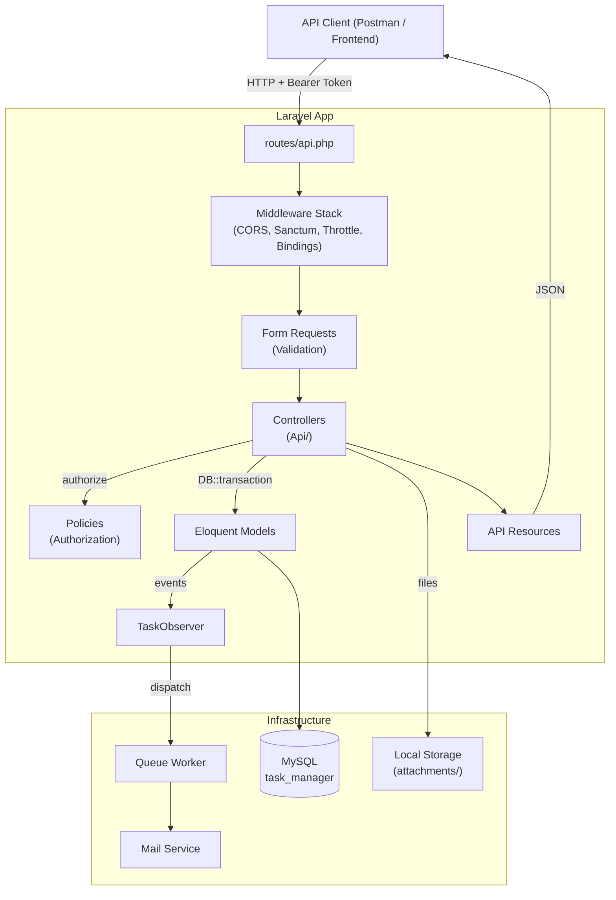
```mermaid
graph TB
    Client["API Client (Postman / Frontend)"]
    
    subgraph Laravel App
        Routes["routes/api.php"]
        MW["Middleware Stack\n(CORS, Sanctum, Throttle, Bindings)"]
        FR["Form Requests\n(Validation)"]
        CT["Controllers\n(Api/)"]
        PL["Policies\n(Authorization)"]
        MDL["Eloquent Models"]
        OBS["TaskObserver"]
        RES["API Resources"]
    end

    subgraph Infrastructure
        DB[(MySQL\ntask_manager)]
        QUEUE["Queue Worker"]
        MAIL["Mail Service"]
        STORAGE["Local Storage\n(attachments/)"]
    end

    Client -->|HTTP + Bearer Token| Routes
    Routes --> MW
    MW --> FR
    FR --> CT
    CT -->|authorize| PL
    CT -->|DB::transaction| MDL
    MDL -->|events| OBS
    OBS -->|dispatch| QUEUE
    QUEUE --> MAIL
    MDL --> DB
    CT -->|files| STORAGE
    CT --> RES
    RES -->|JSON| Client
```

### Authentication Sequence

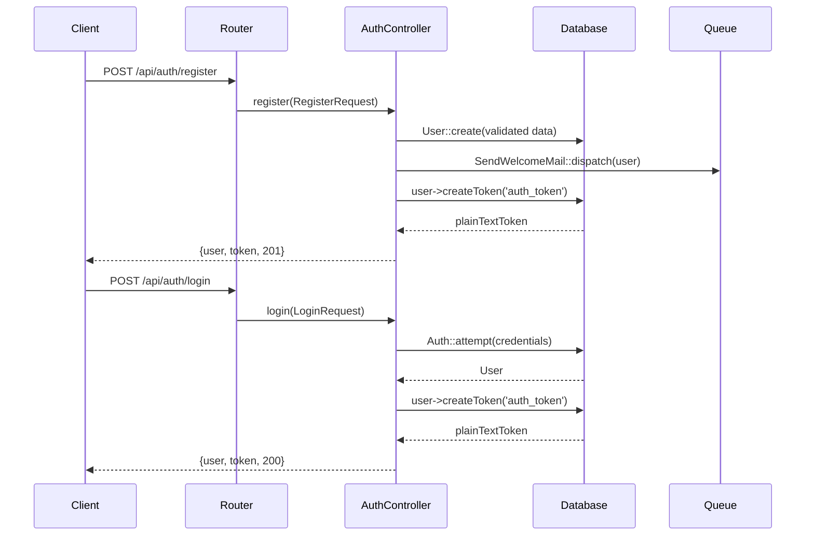
```mermaid
sequenceDiagram
    participant C as Client
    participant R as Router
    participant FC as AuthController
    participant DB as Database
    participant Q as Queue

    C->>R: POST /api/auth/register
    R->>FC: register(RegisterRequest)
    FC->>DB: User::create(validated data)
    FC->>Q: SendWelcomeMail::dispatch(user)
    FC->>DB: user->createToken('auth_token')
    DB-->>FC: plainTextToken
    FC-->>C: {user, token, 201}

    C->>R: POST /api/auth/login
    R->>FC: login(LoginRequest)
    FC->>DB: Auth::attempt(credentials)
    DB-->>FC: User
    FC->>DB: user->createToken('auth_token')
    DB-->>FC: plainTextToken
    FC-->>C: {user, token, 200}
```

### Task Completion & Recurrence Flow

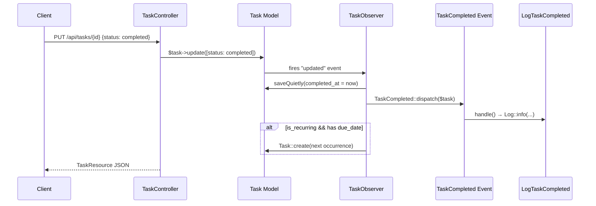
```mermaid
sequenceDiagram
    participant C as Client
    participant TC as TaskController
    participant T as Task Model
    participant OBS as TaskObserver
    participant EV as TaskCompleted Event
    participant LOG as LogTaskCompleted

    C->>TC: PUT /api/tasks/{id} {status: completed}
    TC->>T: $task->update([status: completed])
    T->>OBS: fires "updated" event
    OBS->>T: saveQuietly(completed_at = now)
    OBS->>EV: TaskCompleted::dispatch($task)
    EV->>LOG: handle() → Log::info(...)
    alt is_recurring && has due_date
        OBS->>T: Task::create(next occurrence)
    end
    TC-->>C: TaskResource JSON
```

### Task Index Request Flow

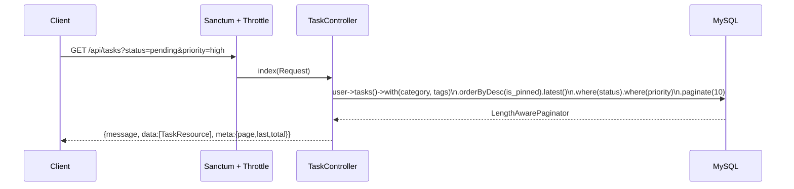
```mermaid
sequenceDiagram
    participant C as Client
    participant MW as Sanctum + Throttle
    participant TC as TaskController
    participant DB as MySQL

    C->>MW: GET /api/tasks?status=pending&priority=high
    MW->>TC: index(Request)
    TC->>DB: user->tasks()->with(category, tags)\n.orderByDesc(is_pinned).latest()\n.where(status).where(priority)\n.paginate(10)
    DB-->>TC: LengthAwarePaginator
    TC-->>C: {message, data:[TaskResource], meta:{page,last,total}}
```

### Database ERD

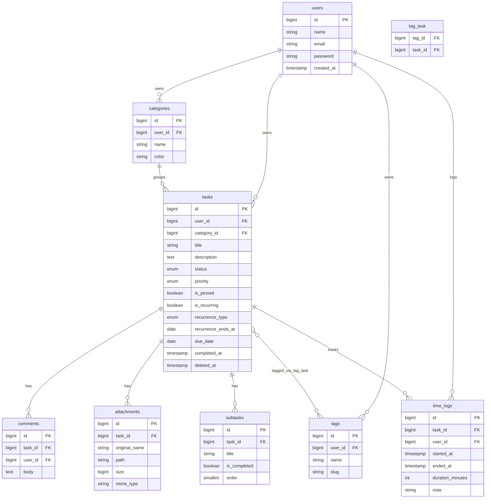
```mermaid
erDiagram
    users {
        bigint id PK
        string name
        string email
        string password
        timestamp created_at
    }

    categories {
        bigint id PK
        bigint user_id FK
        string name
        string color
    }

    tasks {
        bigint id PK
        bigint user_id FK
        bigint category_id FK
        string title
        text description
        enum status
        enum priority
        boolean is_pinned
        boolean is_recurring
        enum recurrence_type
        date recurrence_ends_at
        date due_date
        timestamp completed_at
        timestamp deleted_at
    }

    comments {
        bigint id PK
        bigint task_id FK
        bigint user_id FK
        text body
    }

    tags {
        bigint id PK
        bigint user_id FK
        string name
        string slug
    }

    tag_task {
        bigint tag_id FK
        bigint task_id FK
    }

    attachments {
        bigint id PK
        bigint task_id FK
        string original_name
        string path
        bigint size
        string mime_type
    }

    subtasks {
        bigint id PK
        bigint task_id FK
        string title
        boolean is_completed
        smallint order
    }

    time_logs {
        bigint id PK
        bigint task_id FK
        bigint user_id FK
        timestamp started_at
        timestamp ended_at
        int duration_minutes
        string note
    }

    users ||--o{ categories : owns
    users ||--o{ tasks : owns
    users ||--o{ tags : owns
    users ||--o{ time_logs : logs
    categories ||--o{ tasks : groups
    tasks ||--o{ comments : has
    tasks ||--o{ attachments : has
    tasks ||--o{ subtasks : has
    tasks ||--o{ time_logs : tracks
    tasks }o--o{ tags : tagged_via_tag_task
```

---

## 16. Feature Flowcharts

### Authentication — Register & Login

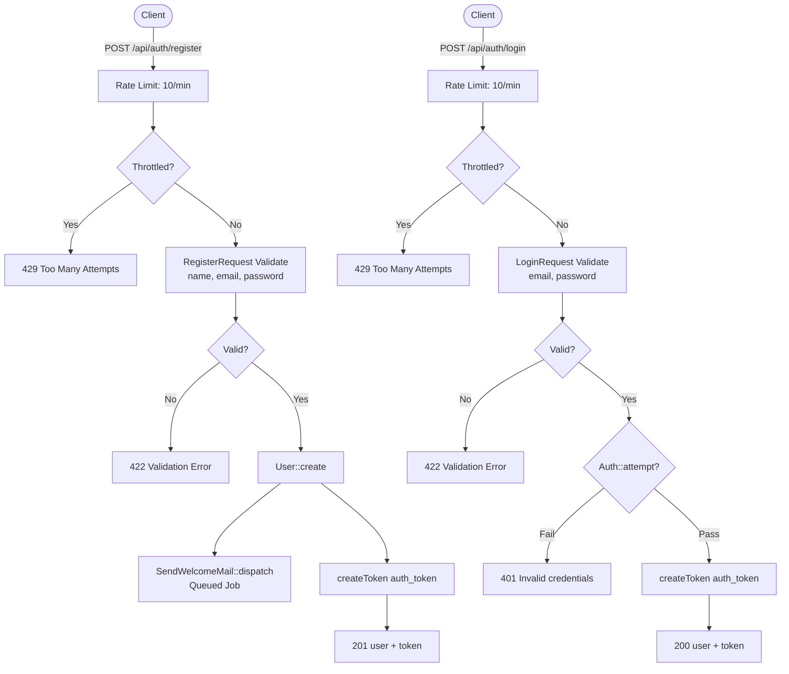
```mermaid
flowchart TD
    A([Client]) -->|POST /api/auth/register| B[Rate Limit: 10/min]
    B --> C{Throttled?}
    C -->|Yes| D[429 Too Many Attempts]
    C -->|No| E[RegisterRequest Validate\nname, email, password]
    E --> F{Valid?}
    F -->|No| G[422 Validation Error]
    F -->|Yes| H[User::create]
    H --> I[SendWelcomeMail::dispatch\nQueued Job]
    H --> J[createToken auth_token]
    J --> K[201 user + token]

    A2([Client]) -->|POST /api/auth/login| B2[Rate Limit: 10/min]
    B2 --> C2{Throttled?}
    C2 -->|Yes| D2[429 Too Many Attempts]
    C2 -->|No| E2[LoginRequest Validate\nemail, password]
    E2 --> F2{Valid?}
    F2 -->|No| G2[422 Validation Error]
    F2 -->|Yes| H2{Auth::attempt?}
    H2 -->|Fail| I2[401 Invalid credentials]
    H2 -->|Pass| J2[createToken auth_token]
    J2 --> K2[200 user + token]
```

---

### Task CRUD — Create, Read, Update, Delete

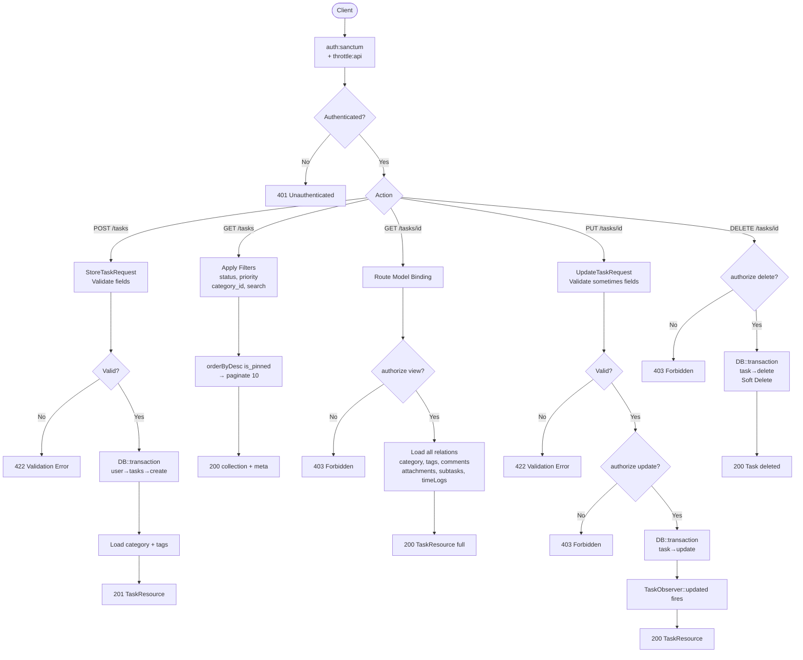
```mermaid
flowchart TD
    A([Client]) --> MW[auth:sanctum\n+ throttle:api]
    MW --> B{Authenticated?}
    B -->|No| C[401 Unauthenticated]

    B -->|Yes| D{Action}

    D -->|POST /tasks| E[StoreTaskRequest\nValidate fields]
    E --> F{Valid?}
    F -->|No| G[422 Validation Error]
    F -->|Yes| H[DB::transaction\nuser→tasks→create]
    H --> I[Load category + tags]
    I --> J[201 TaskResource]

    D -->|GET /tasks| K[Apply Filters\nstatus, priority\ncategory_id, search]
    K --> L[orderByDesc is_pinned\n→ paginate 10]
    L --> M[200 collection + meta]

    D -->|GET /tasks/id| N[Route Model Binding]
    N --> O{authorize view?}
    O -->|No| P[403 Forbidden]
    O -->|Yes| Q[Load all relations\ncategory, tags, comments\nattachments, subtasks, timeLogs]
    Q --> R[200 TaskResource full]

    D -->|PUT /tasks/id| S[UpdateTaskRequest\nValidate sometimes fields]
    S --> T{Valid?}
    T -->|No| U[422 Validation Error]
    T -->|Yes| V{authorize update?}
    V -->|No| W[403 Forbidden]
    V -->|Yes| X[DB::transaction\ntask→update]
    X --> Y[TaskObserver::updated fires]
    Y --> Z[200 TaskResource]

    D -->|DELETE /tasks/id| AA{authorize delete?}
    AA -->|No| AB[403 Forbidden]
    AA -->|Yes| AC[DB::transaction\ntask→delete\nSoft Delete]
    AC --> AD[200 Task deleted]
```

---

### Task Completion & Recurring Task Flow

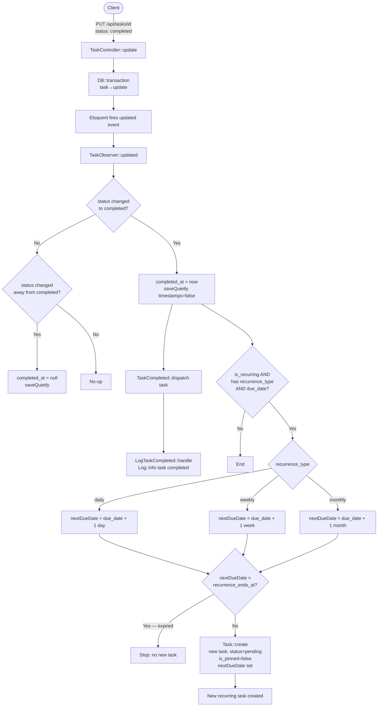
```mermaid
flowchart TD
    A([Client]) -->|PUT /api/tasks/id\nstatus: completed| B[TaskController::update]
    B --> C[DB::transaction\ntask→update]
    C --> D[Eloquent fires updated event]
    D --> E[TaskObserver::updated]

    E --> F{status changed\nto completed?}
    F -->|No| G{status changed\naway from completed?}
    G -->|Yes| H[completed_at = null\nsaveQuietly]
    G -->|No| I[No-op]

    F -->|Yes| J[completed_at = now\nsaveQuietly timestamps=false]
    J --> K[TaskCompleted::dispatch task]
    K --> L[LogTaskCompleted::handle\nLog::info task completed]

    J --> M{is_recurring AND\nhas recurrence_type\nAND due_date?}
    M -->|No| N[End]
    M -->|Yes| O{recurrence_type}
    O -->|daily| P[nextDueDate = due_date + 1 day]
    O -->|weekly| Q[nextDueDate = due_date + 1 week]
    O -->|monthly| R[nextDueDate = due_date + 1 month]

    P --> S{nextDueDate >\nrecurrence_ends_at?}
    Q --> S
    R --> S

    S -->|Yes — expired| T[Stop: no new task]
    S -->|No| U[Task::create\nnew task: status=pending\nis_pinned=false\nnextDueDate set]
    U --> V[New recurring task created]
```

---

### Task Pinning

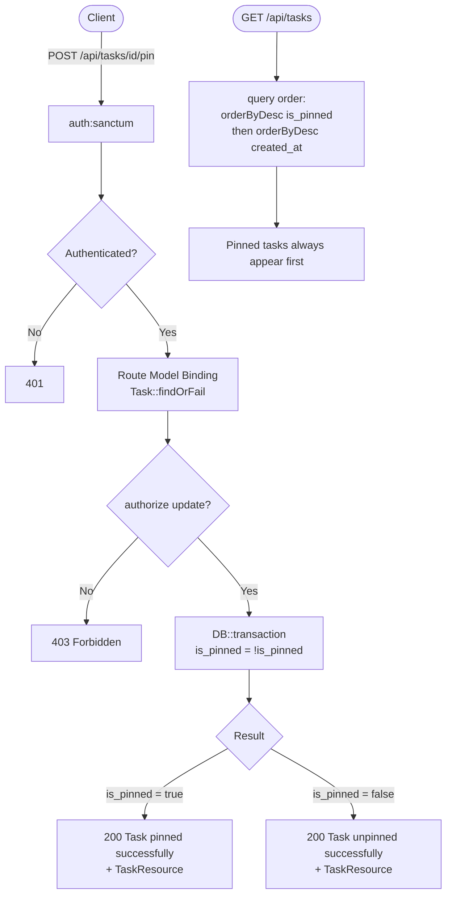
```mermaid
flowchart TD
    A([Client]) -->|POST /api/tasks/id/pin| B[auth:sanctum]
    B --> C{Authenticated?}
    C -->|No| D[401]
    C -->|Yes| E[Route Model Binding\nTask::findOrFail]
    E --> F{authorize update?}
    F -->|No| G[403 Forbidden]
    F -->|Yes| H[DB::transaction\nis_pinned = !is_pinned]
    H --> I{Result}
    I -->|is_pinned = true| J[200 Task pinned successfully\n+ TaskResource]
    I -->|is_pinned = false| K[200 Task unpinned successfully\n+ TaskResource]

    L([GET /api/tasks]) --> M[query order:\norderByDesc is_pinned\nthen orderByDesc created_at]
    M --> N[Pinned tasks always appear first]
```

---

### Bulk Actions

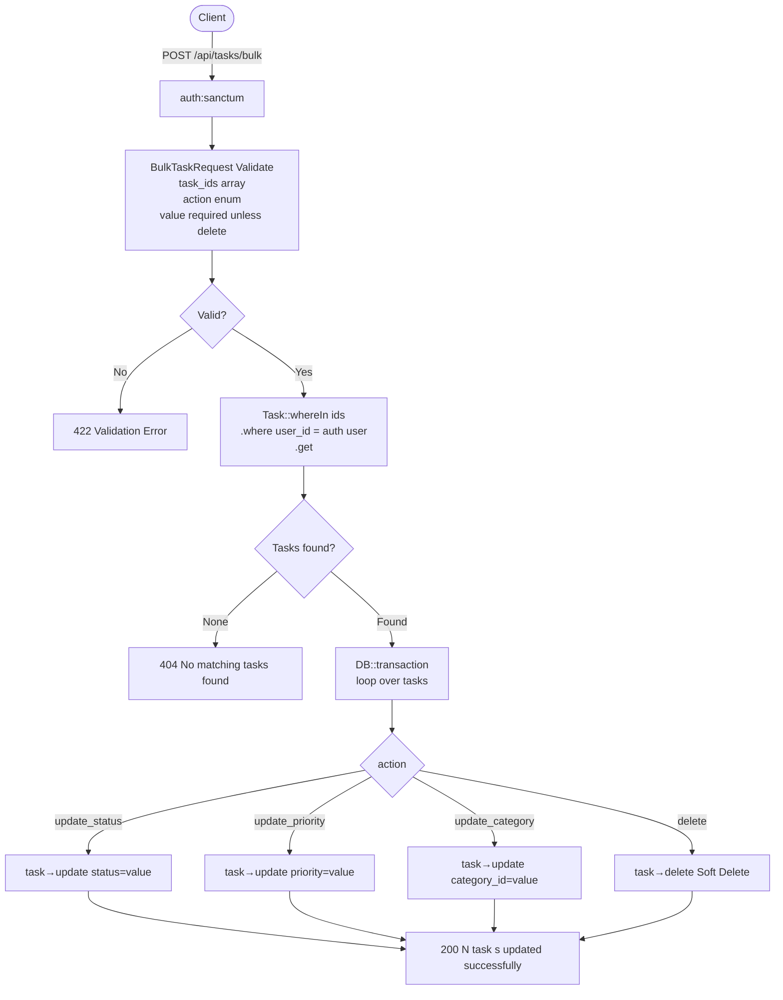
```mermaid
flowchart TD
    A([Client]) -->|POST /api/tasks/bulk| B[auth:sanctum]
    B --> C[BulkTaskRequest Validate\ntask_ids array\naction enum\nvalue required unless delete]
    C --> D{Valid?}
    D -->|No| E[422 Validation Error]
    D -->|Yes| F[Task::whereIn ids\n.where user_id = auth user\n.get]
    F --> G{Tasks found?}
    G -->|None| H[404 No matching tasks found]
    G -->|Found| I[DB::transaction\nloop over tasks]

    I --> J{action}
    J -->|update_status| K[task→update status=value]
    J -->|update_priority| L[task→update priority=value]
    J -->|update_category| M[task→update category_id=value]
    J -->|delete| N[task→delete Soft Delete]

    K --> O[200 N task s updated successfully]
    L --> O
    M --> O
    N --> O
```

---

### Soft Delete & Restore

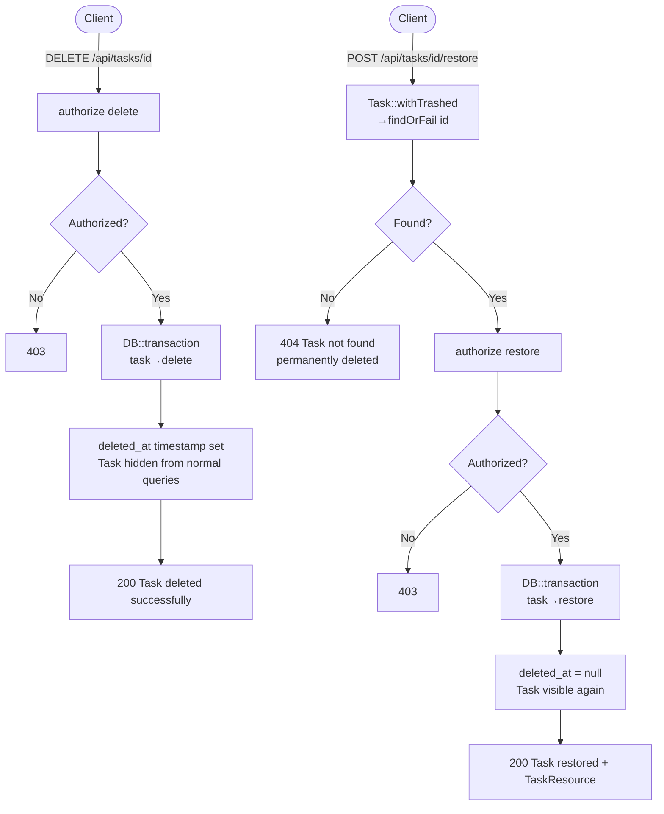
```mermaid
flowchart TD
    A([Client]) -->|DELETE /api/tasks/id| B[authorize delete]
    B --> C{Authorized?}
    C -->|No| D[403]
    C -->|Yes| E[DB::transaction\ntask→delete]
    E --> F[deleted_at timestamp set\nTask hidden from normal queries]
    F --> G[200 Task deleted successfully]

    H([Client]) -->|POST /api/tasks/id/restore| I[Task::withTrashed\n→findOrFail id]
    I --> J{Found?}
    J -->|No| K[404 Task not found\npermanently deleted]
    J -->|Yes| L[authorize restore]
    L --> M{Authorized?}
    M -->|No| N[403]
    M -->|Yes| O[DB::transaction\ntask→restore]
    O --> P[deleted_at = null\nTask visible again]
    P --> Q[200 Task restored + TaskResource]
```

---

### Categories

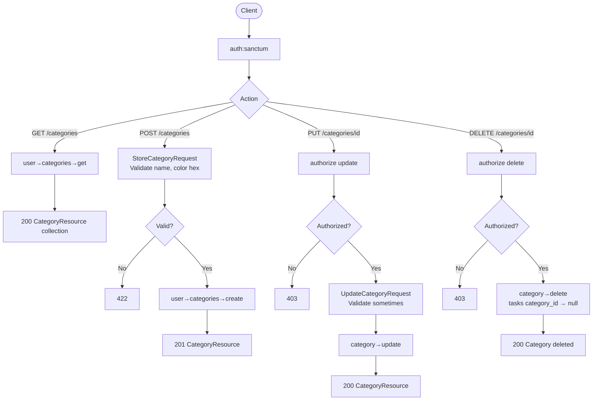
```mermaid
flowchart TD
    A([Client]) --> B[auth:sanctum]
    B --> C{Action}

    C -->|GET /categories| D[user→categories→get]
    D --> E[200 CategoryResource collection]

    C -->|POST /categories| F[StoreCategoryRequest\nValidate name, color hex]
    F --> G{Valid?}
    G -->|No| H[422]
    G -->|Yes| I[user→categories→create]
    I --> J[201 CategoryResource]

    C -->|PUT /categories/id| K[authorize update]
    K --> L{Authorized?}
    L -->|No| M[403]
    L -->|Yes| N[UpdateCategoryRequest\nValidate sometimes]
    N --> O[category→update]
    O --> P[200 CategoryResource]

    C -->|DELETE /categories/id| Q[authorize delete]
    Q --> R{Authorized?}
    R -->|No| S[403]
    R -->|Yes| T[category→delete\ntasks category_id → null]
    T --> U[200 Category deleted]
```

---

### Tags & Tag Sync

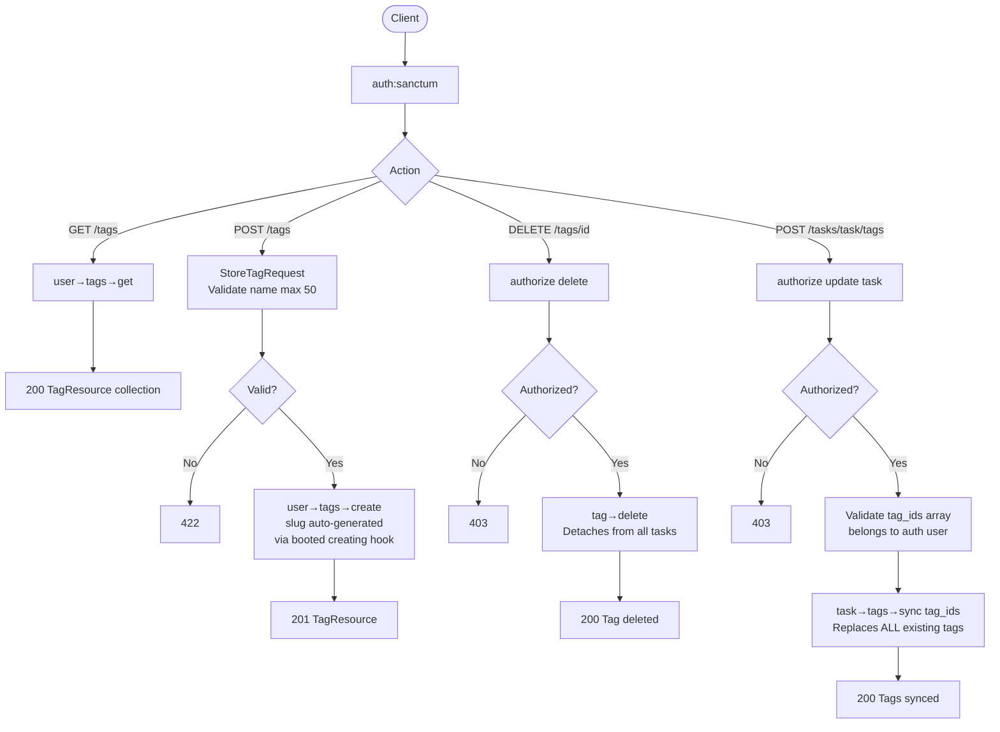
```mermaid
flowchart TD
    A([Client]) --> B[auth:sanctum]
    B --> C{Action}

    C -->|GET /tags| D[user→tags→get]
    D --> E[200 TagResource collection]

    C -->|POST /tags| F[StoreTagRequest\nValidate name max 50]
    F --> G{Valid?}
    G -->|No| H[422]
    G -->|Yes| I[user→tags→create\nslug auto-generated\nvia booted creating hook]
    I --> J[201 TagResource]

    C -->|DELETE /tags/id| K[authorize delete]
    K --> L{Authorized?}
    L -->|No| M[403]
    L -->|Yes| N[tag→delete\nDetaches from all tasks]
    N --> O[200 Tag deleted]

    C -->|POST /tasks/task/tags| P[authorize update task]
    P --> Q{Authorized?}
    Q -->|No| R[403]
    Q -->|Yes| S[Validate tag_ids array\nbelongs to auth user]
    S --> T[task→tags→sync tag_ids\nReplaces ALL existing tags]
    T --> U[200 Tags synced]
```

---

### Comments

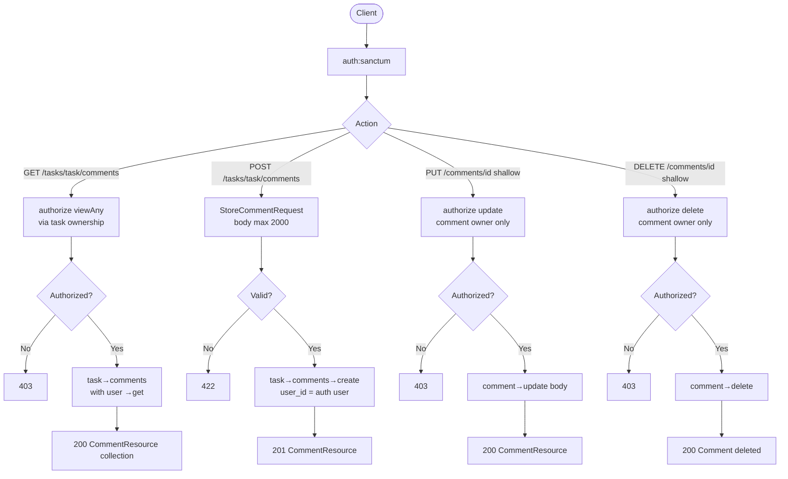
```mermaid
flowchart TD
    A([Client]) --> B[auth:sanctum]
    B --> C{Action}

    C -->|GET /tasks/task/comments| D[authorize viewAny\nvia task ownership]
    D --> E{Authorized?}
    E -->|No| F[403]
    E -->|Yes| G[task→comments\nwith user →get]
    G --> H[200 CommentResource collection]

    C -->|POST /tasks/task/comments| I[StoreCommentRequest\nbody max 2000]
    I --> J{Valid?}
    J -->|No| K[422]
    J -->|Yes| L[task→comments→create\nuser_id = auth user]
    L --> M[201 CommentResource]

    C -->|PUT /comments/id shallow| N[authorize update\ncomment owner only]
    N --> O{Authorized?}
    O -->|No| P[403]
    O -->|Yes| Q[comment→update body]
    Q --> R[200 CommentResource]

    C -->|DELETE /comments/id shallow| S[authorize delete\ncomment owner only]
    S --> T{Authorized?}
    T -->|No| U[403]
    T -->|Yes| V[comment→delete]
    V --> W[200 Comment deleted]
```

---

### File Attachments

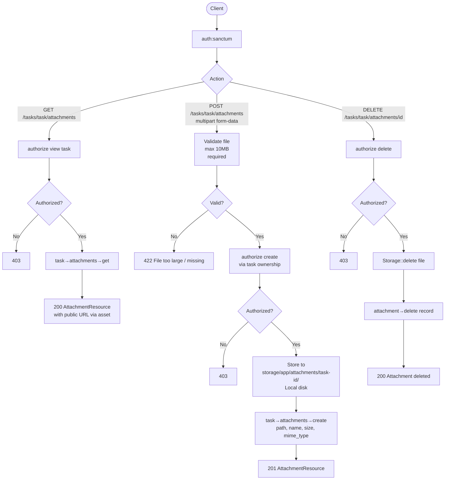
```mermaid
flowchart TD
    A([Client]) --> B[auth:sanctum]
    B --> C{Action}

    C -->|GET /tasks/task/attachments| D[authorize view task]
    D --> E{Authorized?}
    E -->|No| F[403]
    E -->|Yes| G[task→attachments→get]
    G --> H[200 AttachmentResource\nwith public URL via asset]

    C -->|POST /tasks/task/attachments\nmultipart form-data| I[Validate file\nmax 10MB\nrequired]
    I --> J{Valid?}
    J -->|No| K[422 File too large / missing]
    J -->|Yes| L[authorize create\nvia task ownership]
    L --> M{Authorized?}
    M -->|No| N[403]
    M -->|Yes| O[Store to\nstorage/app/attachments/task-id/\nLocal disk]
    O --> P[task→attachments→create\npath, name, size, mime_type]
    P --> Q[201 AttachmentResource]

    C -->|DELETE /tasks/task/attachments/id| R[authorize delete]
    R --> S{Authorized?}
    S -->|No| T[403]
    S -->|Yes| U[Storage::delete file]
    U --> V[attachment→delete record]
    V --> W[200 Attachment deleted]
```

---

### Subtasks / Checklists

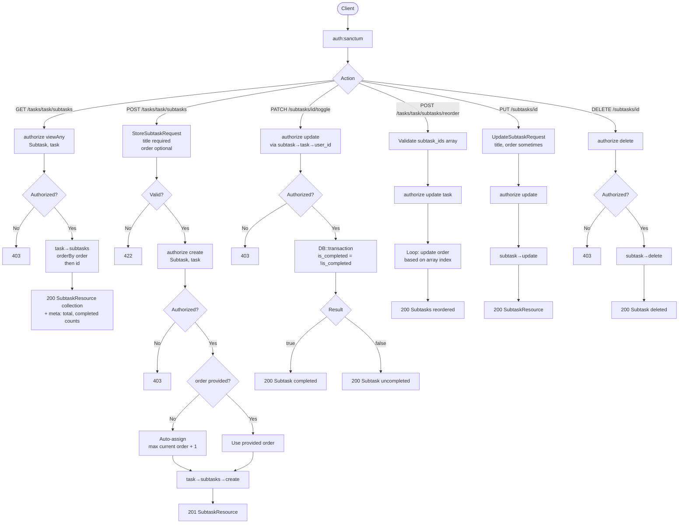
```mermaid
flowchart TD
    A([Client]) --> B[auth:sanctum]
    B --> C{Action}

    C -->|GET /tasks/task/subtasks| D[authorize viewAny\nSubtask, task]
    D --> E{Authorized?}
    E -->|No| F[403]
    E -->|Yes| G[task→subtasks\norderBy order\nthen id]
    G --> H[200 SubtaskResource collection\n+ meta: total, completed counts]

    C -->|POST /tasks/task/subtasks| I[StoreSubtaskRequest\ntitle required\norder optional]
    I --> J{Valid?}
    J -->|No| K[422]
    J -->|Yes| L[authorize create\nSubtask, task]
    L --> M{Authorized?}
    M -->|No| N[403]
    M -->|Yes| O{order provided?}
    O -->|No| P[Auto-assign\nmax current order + 1]
    O -->|Yes| Q[Use provided order]
    P --> R[task→subtasks→create]
    Q --> R
    R --> S[201 SubtaskResource]

    C -->|PATCH /subtasks/id/toggle| T[authorize update\nvia subtask→task→user_id]
    T --> U{Authorized?}
    U -->|No| V[403]
    U -->|Yes| W[DB::transaction\nis_completed = !is_completed]
    W --> X{Result}
    X -->|true| Y[200 Subtask completed]
    X -->|false| Z[200 Subtask uncompleted]

    C -->|POST /tasks/task/subtasks/reorder| AA[Validate subtask_ids array]
    AA --> AB[authorize update task]
    AB --> AC[Loop: update order\nbased on array index]
    AC --> AD[200 Subtasks reordered]

    C -->|PUT /subtasks/id| AE[UpdateSubtaskRequest\ntitle, order sometimes]
    AE --> AF[authorize update]
    AF --> AG[subtask→update]
    AG --> AH[200 SubtaskResource]

    C -->|DELETE /subtasks/id| AI[authorize delete]
    AI --> AJ{Authorized?}
    AJ -->|No| AK[403]
    AJ -->|Yes| AL[subtask→delete]
    AL --> AM[200 Subtask deleted]
```

---

### Time Tracking

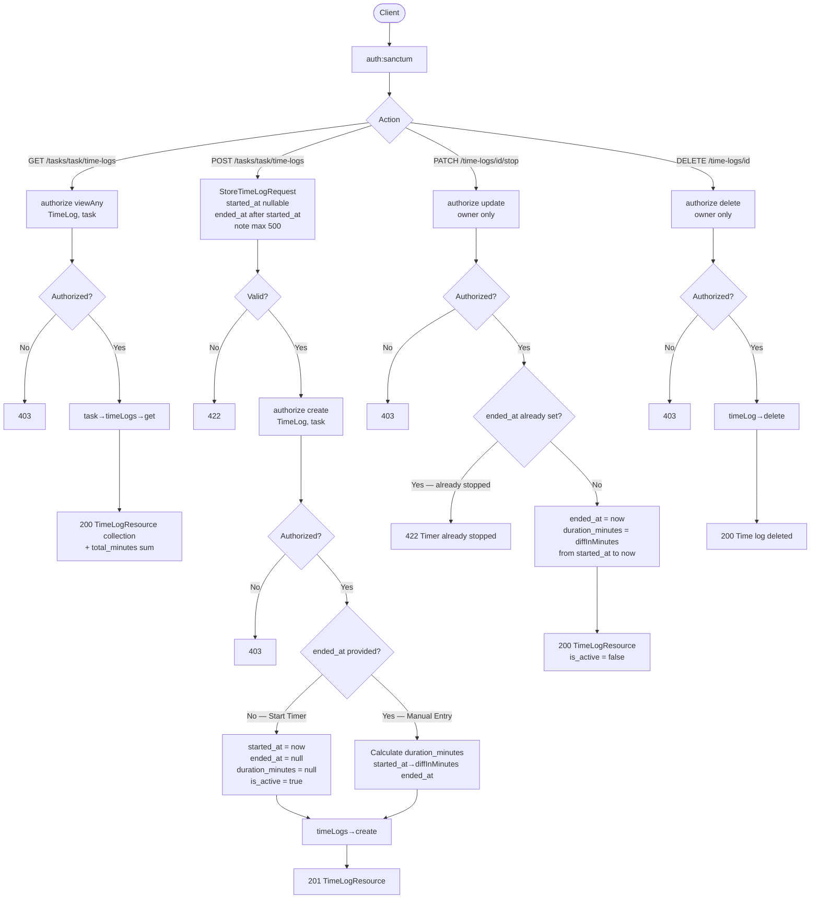
```mermaid
flowchart TD
    A([Client]) --> B[auth:sanctum]
    B --> C{Action}

    C -->|GET /tasks/task/time-logs| D[authorize viewAny\nTimeLog, task]
    D --> E{Authorized?}
    E -->|No| F[403]
    E -->|Yes| G[task→timeLogs→get]
    G --> H[200 TimeLogResource collection\n+ total_minutes sum]

    C -->|POST /tasks/task/time-logs| I[StoreTimeLogRequest\nstarted_at nullable\nended_at after started_at\nnote max 500]
    I --> J{Valid?}
    J -->|No| K[422]
    J -->|Yes| L[authorize create\nTimeLog, task]
    L --> M{Authorized?}
    M -->|No| N[403]
    M -->|Yes| O{ended_at provided?}

    O -->|No — Start Timer| P[started_at = now\nended_at = null\nduration_minutes = null\nis_active = true]
    O -->|Yes — Manual Entry| Q[Calculate duration_minutes\nstarted_at→diffInMinutes ended_at]
    P --> R[timeLogs→create]
    Q --> R
    R --> S[201 TimeLogResource]

    C -->|PATCH /time-logs/id/stop| T[authorize update\nowner only]
    T --> U{Authorized?}
    U -->|No| V[403]
    U -->|Yes| W{ended_at already set?}
    W -->|Yes — already stopped| X[422 Timer already stopped]
    W -->|No| Y[ended_at = now\nduration_minutes = diffInMinutes\nfrom started_at to now]
    Y --> Z[200 TimeLogResource\nis_active = false]

    C -->|DELETE /time-logs/id| AA[authorize delete\nowner only]
    AA --> AB{Authorized?}
    AB -->|No| AC[403]
    AB -->|Yes| AD[timeLog→delete]
    AD --> AE[200 Time log deleted]
```

---

### Due Date Reminder Scheduler

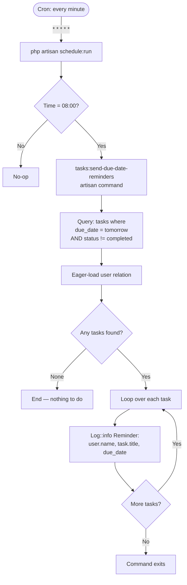
```mermaid
flowchart TD
    A([Cron: every minute]) -->|* * * * *| B[php artisan schedule:run]
    B --> C{Time = 08:00?}
    C -->|No| D[No-op]
    C -->|Yes| E[tasks:send-due-date-reminders\nartisan command]
    E --> F[Query: tasks where\ndue_date = tomorrow\nAND status != completed]
    F --> G[Eager-load user relation]
    G --> H{Any tasks found?}
    H -->|None| I[End — nothing to do]
    H -->|Yes| J[Loop over each task]
    J --> K[Log::info Reminder:\nuser.name, task.title, due_date]
    K --> L{More tasks?}
    L -->|Yes| J
    L -->|No| M[Command exits]
```

---

### Welcome Email — Queue & Job Flow

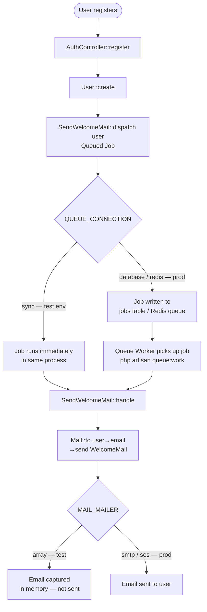
```mermaid
flowchart TD
    A([User registers]) --> B[AuthController::register]
    B --> C[User::create]
    C --> D[SendWelcomeMail::dispatch user\nQueued Job]
    D --> E{QUEUE_CONNECTION}

    E -->|sync — test env| F[Job runs immediately\nin same process]
    E -->|database / redis — prod| G[Job written to\njobs table / Redis queue]
    G --> H[Queue Worker picks up job\nphp artisan queue:work]

    F --> I[SendWelcomeMail::handle]
    H --> I
    I --> J[Mail::to user→email\n→send WelcomeMail]
    J --> K{MAIL_MAILER}
    K -->|array — test| L[Email captured\nin memory — not sent]
    K -->|smtp / ses — prod| M[Email sent to user]
```

---

## 17. Technical Debt & Concerns

| Area | Issue | Severity |
|---|---|---|
| **JWT unused** | `tymon/jwt-auth` is installed and `User` implements `JWTSubject` but JWT is never wired into routes. Creates dead code and install overhead. | Low |
| **Scheduler reminders** | `tasks:send-due-date-reminders` only logs — no actual email/notification dispatch. Not production-ready. | Medium |
| **Attachment URL** | `AttachmentResource` uses `asset('storage/' . $path)` which requires `php artisan storage:link` to be run. Fails silently if not run. | Low |
| **SubtaskPolicy extra load** | `SubtaskPolicy::update()` calls `$subtask->task->user_id` which lazy-loads the `task` relationship if not already loaded — potential extra query per authorization check. | Low |
| **No token expiry** | Sanctum tokens never expire (`expiration: null`). No refresh token mechanism. | Medium |
| **TimeLog no active-timer guard** | Nothing prevents creating multiple active (no `ended_at`) timers on the same task simultaneously. | Low |
| **No API versioning** | All routes are under `/api/` with no version prefix (e.g., `/api/v1/`). Breaking changes would affect all clients immediately. | Medium |
| **Tests incomplete** | Feature tests exist for Auth, Tasks, and Categories. Subtasks, TimeLogs, Bulk, Pin, and Recurrence have no test coverage. | High |
